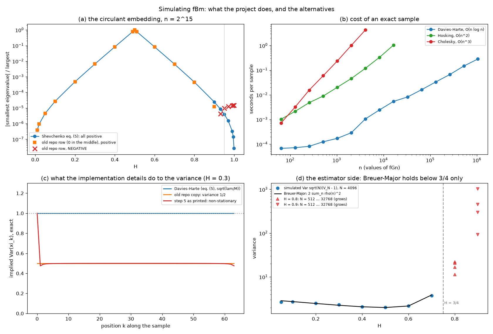

# Simulating fBm: what the project does, and how it compares

*Your questions answered, with the code checked line by line against Shevchenko (2014), "Fractional Brownian motion in a nutshell", arXiv:1406.1956, Section 6. Session I, 18 September 2026.*

## The short answer

1. **Which method: one method, the circulant one.** The project simulates fractional
   Gaussian noise (fGn) by circulant embedding, i.e. Davies–Harte. For fGn this is
   literally the same algorithm as Wood–Chan, so the project does not run two methods
   independently. Wood–Chan adds two fallbacks to the circulant idea: enlarging the
   embedding, or truncating negative eigenvalues, when the circulant is not nonnegative
   definite. For fGn they never trigger, because its minimal embedding is nonnegative
   at every H. That was verified here up to H = 0.999. Shevchenko himself calls the
   method "the Wood–Chan, or circulant method".
2. **Yes, it takes a square root of the covariance of a centred Gaussian vector.** The
   vector is n values of fGn, and its covariance is the n × n Toeplitz matrix
   T = [ρ_H(|i−j|)] with ρ_H(k) = ½(|k+1|^{2H} − 2|k|^{2H} + |k−1|^{2H}). The square
   root is not found by Cholesky:
   - T is embedded in a larger circulant C = circ(c), which the FFT diagonalises:
     C = QΛQ\*.
   - S = QΛ^{1/2}Q\* then satisfies SS\* = C.
   - The first n entries of Sζ, for standard Gaussian ζ, are exact fGn.
   - fBm is their cumulative sum, times (T/n)^H on [0, T].

   The cost is three FFTs instead of an O(n³) factorisation.
3. **Breuer–Major is not part of the simulation.** It is the central limit theorem for
   the **estimators** of H, not a way to generate paths. For a stationary unit Gaussian
   sequence with covariance ρ and a function g of Hermite rank d with
   Σ_n |ρ(n)|^d < ∞,

   N^{−1/2} Σ_k g(ξ_k) → N(0, σ²), with σ² = Σ_{q≥d} q! a_q² Σ_{k∈ℤ} ρ(k)^q.

   That is your formula. With g(x) = x² − 1 (Hermite rank 2, a₂ = 1) it gives
   σ² = 2 Σ_k ρ(k)². This is what makes quadratic-variation estimators of H √N-normal,
   and only when H < 3/4 for first differences (Shevchenko, Theorem 5.5). It is now in
   the code as `models.fbm.breuer_major_variance`, and it is tested against simulation:
   - **H from 0.05 to 0.7:** it matches the simulated variance of √N(V_N − 1) to
     within 8%.
   - **H = 0.8 and 0.9:** the normalised variance keeps growing with N, as it must above
     3/4. There is no central limit there.
4. **Shevchenko's steps 1–10 are not outdated**, with one erratum and two annotations
   (see *The steps, one by one*). Circulant embedding is still the standard exact
   O(n log n) method for fGn on an equispaced grid.
   - **Erratum: step 5 as printed is wrong.** It says to take the real part of the
     inverse FFT. That gives a non-stationary covariance: variance 1 at the first point
     and ½ everywhere else, computed exactly. His own Matlab code on the next page keeps
     the complex inverse FFT and is exact.
5. **Where fBm is used here, and where it is not.** fBm appears only as exact test data
   for the H estimators: the structure-function tests, the health checks, and the
   log-volatility path in `capture_v3.py`. **The rough Heston model is not simulated
   from fBm.** Its variance is a Volterra process with kernel K(t) = t^{H−½}/Γ(H+½):
   - its paths are simulated through the Markovian lift (40 OU factors driven by one
     Brownian motion) with the positivity-preserving QE step;
   - its characteristic function comes from the lifted Riccati equations, checked
     against fractional Adams.

   If you are debugging rough-volatility paths, the fBm generator is not on that path.

## What was wrong in our code, and what changed

Before today, three copies of a Davies–Harte routine lived in `test_surface.py`,
`healthcheck.py` and `capture_v3.py`. Checking them against Section 6 turned up two
defects, both now fixed in a single module, `models/fbm.py`:

| | old copies | now (`models/fbm.py`) |
|---|---|---|
| middle entry of the circulant row | **0** | ρ(N−1), as in eq. (5) |
| embedding nonnegative | fails from **H ≈ 0.93** (n = 2^15); the copies raised there and blamed fBm | at every H tested, up to 0.999 |
| scaling of the complex FFT trick | √(λ/2M): **variance ½** (implied covariance = T/2 exactly) | √(λ/M): variance 1 |
| FFT size | minimal 2(n−1), whatever its prime factors | padded to the next 5-smooth size |
| copies | 3 | 1 module; `test_fbm.py`, 19 checks |

**Impact on reported results: none.** Every fixture used H ≤ 0.5, where the old
embedding is nonnegative, so the draws had exactly the right correlations. Every
estimator they fed (structure function, log-log slopes) is scale-free. The suites that
use them still pass on the new generator: `test_surface.py` 45 of 45, and the health
check's H routes within 0.005 of the planted H.

## The methods compared

| method | exact? | cost per sample (this laptop) | role in the project |
|---|---|---|---|
| Cholesky of T | exact | O(n³): 16 ms at n = 256, **4.3 s** at 4096 | reference in the tests |
| Hosking (Durbin–Levinson) | exact | O(n²): 0.12 s at 4096, 1.0 s at 16 384 | reference in the tests |
| **Davies–Harte / Wood–Chan circulant** | exact for fGn at every H | O(n log n): **1.1 ms** at 4096, 0.28 s at 2^20 | the generator |
| Shevchenko step 5 taken literally | wrong covariance (off by 0.51) | — | erratum |
| the old repo copies | right correlations, variance ½; fails from H ≈ 0.93 | — | replaced |
| Riemann–Liouville sum with a point-sampled kernel | biased: Ĥ = 0.26 for a planted 0.12 | — | Session A's first fixture, removed then |
| hybrid scheme, κ = 1 (Bennedsen–Lunde–Pakkanen 2017) | exact on the singular cell; approximates the Riemann–Liouville process, which is not fBm | O(n log n) | the Session A debug script only |
| Markovian lift, N = 40 | a Volterra process with a sum-of-exponentials kernel, not fBm | O(nN) | the rough Heston simulator |

All four exact methods reproduce T to 1e-15 when their implied covariance is computed
from the linear map, not sampled (`study_fbm_methods.py`, section A). Approximate fBm
generators (spectral, random midpoint displacement, wavelets) are not needed when the
exact one takes a millisecond.

## The steps, one by one

| step (Sec. 6) | what it says | status |
|---|---|---|
| 1 | N = 2^q + 1, M = 2^{q+1} | **Still worth doing with NumPy.** Its FFT falls back to Bluestein's algorithm for large prime factors. n = 1500 unpadded (M = 2998 = 2 × 1499) is 4.3× slower than M = 4096, and n = 100 003 is 5.1× slower. A 5-smooth size is enough, and the generator pads to one. |
| 2 | ρ_H(1..N−1), c by eq. (5) | current; the middle entry must be ρ_H(N−1) (our old copies had 0) |
| 3 | FFT for λ, keep the real part | current |
| 4 | standard Gaussians ζ | current. Complex Gaussians instead give **two** independent samples per FFT (the real and imaginary parts); the generator does this. |
| 5 | "take the real part of the inverse FFT" | **erratum**: the real part must not be taken here. The Matlab code keeps the complex inverse FFT and is exact; the text's version is not (figure, panel c). |
| 6 | multiply by √λ | current |
| 7 | FFT | current |
| 8 | real part, first N values | current |
| 9 | multiply by (T/N)^H | current: self-similarity |
| 10 | cumulative sums | current |

The positivity statement behind step 3, that C is positive definite in the case of fBm,
is correct for eq. (5). This is proved for H ≤ ½ (Craigmile 2003) and for H ≥ ½ (Dietrich
& Newsam 1997; Perrin et al. 2002), and measured here: the smallest eigenvalue over the
largest is at least +2.6e-8 at every H from 0.01 to 0.999.

{width=full}

## For your debugging

- **The generator:** `models/fbm.py`, with `fgn(n, H, rng, size, method)` and
  `fbm(n, H, rng, T, size, method)`, where method is "davies-harte" (default),
  "cholesky" or "hosking".
- **The estimator side:** `quadratic_variation_hurst` (Shevchenko's standard estimator)
  and `breuer_major_variance`.
- **The checks:** `test_fbm.py` and `study_fbm_methods.py`. The study computes each
  method's covariance exactly and reproduces the erratum and the old defects.
