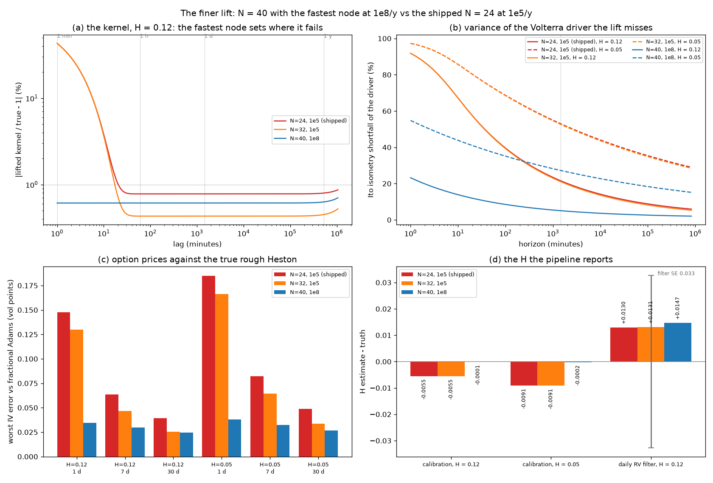

# Adopting the finer lift

*N = 40 nodes with the fastest at 1e8/y, against the shipped N = 24 at 1e5/y. A comparison for your decision. Session H, 15 September 2026.*

## The choice

The lift replaces the fractional kernel K(t) = t^(H−½)/Γ(H+½) with Σ wᵢ e^(−xᵢ t). Two
settings matter:

- **N**, the number of nodes;
- **η_N**, the fastest node, which sets the shortest time scale on which the kernel is right.

Three candidates were measured. The middle one is what the calibration already refines
to today whenever a fit lands below H = 0.08.

| | shipped | more nodes, same top | **finer** |
|---|---|---|---|
| N | 24 | 32 | **40** |
| fastest node η_N | 1e5/y | 1e5/y | **1e8/y** |
| its time scale | 7 minutes | 6.5 minutes | **0.4 seconds** |
| K_N(0) at H = 0.12 / 0.05 | 62 / 124 | 62 / 124 | 854 / 2781 |

`models.rough_heston.using_lift(N, η_N)` swaps the lift for the whole stack at once:
pricer, calibration, Kalman, particle and cf filters, simulators. Every number below is
therefore what adoption would actually do, measured through the production code
(`study_finer_lift.py`, results in `captures/finer_lift.json`).

## 1. The kernel

| H = 0.12 | shipped | N = 32 | finer |
|---|---|---|---|
| kernel error on [5 min, 2 y] | 12.1% | 12.1% | **0.7%** |
| kernel error on [1 h, 2 y] (and [1 d, 2 y]) | 0.87% | 0.52% | 0.70% |
| Itô-isometry shortfall of the driver at 1 h / 1 d / 1 month / 1 y | 44.5 / 21.6 / 10.4 / 6.4% | 44.3 / 21.1 / 9.8 / 5.8% | **9.5 / 5.1 / 2.9 / 2.2%** |
| local roughness (variogram exponent) at 1 h, exact 0.241 | 0.479 | 0.481 | **0.270** |
| same at 1 day, exact 0.241 | 0.323 | 0.324 | **0.253** |

| H = 0.05 | shipped | N = 32 | finer |
|---|---|---|---|
| kernel error on [5 min, 2 y] | 14.9% | 14.8% | **0.8%** |
| isometry shortfall at 1 h / 1 d / 1 month / 1 y | 72.2 / 53.0 / 38.3 / 30.3% | 72.0 / 52.7 / 37.8 / 29.7% | **36.9 / 27.3 / 19.8 / 15.8%** |
| variogram exponent at 1 h / 1 d, exact 0.108 / 0.105 | 0.420 / 0.238 | 0.421 / 0.239 | **0.169 / 0.142** |

**Reading.** The shipped lift's sup-norm error is under 1% from an hour up, yet it still
misses a fifth of the driver's variance over a day. Almost all of that shortfall comes
from lags under 7 minutes, where the lifted kernel is capped at K_N(0). At the one-hour
scale the process it produces is **twice as smooth as the true one** (exponent 0.48
against 0.24). Adding nodes below the same top node changes nothing; moving the top
node does. At H = 0.05 even the finer lift leaves a visible gap, because the kernel's
singularity is stronger.

## 2. Prices against the true rough Heston

The reference is fractional Adams at 2M steps; its own error, M vs 2M, is at most
1.6e-4 vp. The worst implied-vol error over six strikes from −2.5 to +1 standard
deviations:

| | 1 day | 7 days | 30 days |
|---|---|---|---|
| H = 0.12: shipped / N = 32 / finer | 0.148 / 0.130 / **0.034** vp | 0.063 / 0.047 / **0.030** vp | 0.039 / 0.026 / **0.025** vp |
| H = 0.12 ATM skew error | −1.6 / −1.4 / **−0.4%** | −0.7 / −0.5 / **−0.3%** | −0.4 / −0.3 / **−0.3%** |
| H = 0.05: shipped / N = 32 / finer | 0.185 / 0.166 / **0.038** vp | 0.082 / 0.064 / **0.032** vp | 0.049 / 0.034 / **0.027** vp |
| H = 0.05 ATM skew error | −1.5 / −1.3 / **−0.3%** | −0.7 / −0.5 / **−0.3%** | −0.5 / −0.3 / **−0.3%** |

The shipped lift is 4–5× less accurate at one day, and the error sits where H is read.
From a month out all three are within 0.05 vp.

## 3. The H the pipeline reports

**Calibration.** A 10-expiry × 13-strike surface (1 day to 1 year) was priced by
fractional Adams, i.e. by the true model, then fitted by the production calibration
from the true parameters on each lift. This is the lift's own bias, with no noise and no
local minima:

| truth | shipped | N = 32 | finer |
|---|---|---|---|
| H = 0.12: fitted H (fit RMSE) | 0.1145 (0.006 vp) | 0.1145 (0.006 vp) | **0.1199** (0.000 vp) |
| H = 0.05: fitted H (fit RMSE) | 0.0409 (0.008 vp) | 0.0409 (0.008 vp) | **0.0498** (0.000 vp) |

**The shipped lift biases the calibrated H low by 0.0055 at H = 0.12 and by 0.009 at
H = 0.05.** The fit absorbs its one-day pricing error into roughness, which leaves a fit
RMSE of only 0.006–0.008 vp: the bias is invisible in the residuals. N = 32 gives an
identical bias, so the calibration's current refinement to N = 32 buys nothing. The
finer lift recovers H to within 0.0002.

**The realised-variance filter.** 500 days of 5-minute returns were simulated with a
much finer lift (N = 64, fastest node 1e10) standing in for the true process. H was
profiled from daily realised variance on each lift:

| truth H = 0.12 | shipped | N = 32 | finer |
|---|---|---|---|
| H from daily realised variance | 0.133 ± 0.033 | 0.133 ± 0.033 | 0.135 ± 0.032 |

Daily integration averages the sub-hour kernel away, so **the lift does not matter for
the history's H** at daily sampling. It would matter for intraday estimation, which the
pipeline does not do.

## 4. Cost

**The absolute times in this section are inflated.** They were measured this afternoon
on a laptop CPU that was thermally throttled after hours at full load: the Windows
processor-performance counter read 33%, and the healthcheck's rough objective, 0.60 s
this morning, took 3.3 s on unchanged code. The lifts were measured back to back under
the same conditions, so the **ratios** are the comparable numbers.

| per operation | shipped | N = 32 | finer | finer ÷ shipped |
|---|---|---|---|---|
| Riccati step, 640 u-nodes | 1394 µs | 1460 µs | 1922 µs | **1.38×** |
| rough objective, 10 expiries × 13 strikes, with the pricer's checks | 3.04 s | 3.62 s | 4.38 s | **1.44×** |
| calibration wall time, from the truth (H = 0.12 / 0.05) | 450 / 375 s | 491 / 439 s | 431 / 579 s | 1.0–1.5× |
| Kalman filter per day, spot / realised variance | 654 / 767 µs | 848 / 1092 µs | 1357 / 1482 µs | **2.1× / 1.9×** |
| particle filter per day, 500 particles | 11.6 ms | 13.0 ms | 14.4 ms | 1.24× |
| cf filter per day, plus coefficients per parameter set | 2.63 ms + 0.8 s | 3.43 ms + 0.8 s | 4.56 ms + 1.0 s | 1.73× |
| exact-moment step construction | 10.9 ms | 20.9 ms | 55.3 ms | 5.1× |
| QE simulation step, 10,000 paths | 19.7 ms | 23.4 ms | 34.5 ms | 1.75× |

Scaled to this morning's unthrottled objective, the finer lift's objective would take
about 0.9 s instead of 0.6 s. Every pricer check passed on the finer lift, all ten
expiries at max|φ| = 0.999986, and all its post-fit stability checks passed. The
Riccati stability constants were measured on the shipped lift, though. The finer lift
puts more weight into the first minutes of the kernel, so they should be re-measured on
it as part of adoption rather than assumed.

{width=full}

## 5. What adoption involves

- **Code: two defaults.** `N_DEFAULT = 40`, and `η_N = 1e8` in `lift_nodes` and
  `log_char_func`. Every consumer reads them. The calibration's `refine_N = 32` becomes
  redundant and should go. Re-measure the ETDRK4 and implicit-scheme stability constants
  on the new lift (`C_STAB`).
- **Tests: a deliberate re-baselining.** Several checks pin numbers of the shipped lift:
  K_N(0) = 61.9, the kernel error 0.87%, the fastest node's 7 minutes, the 21.6%
  isometry figure, and timing trends. They move to the finer lift's values in one commit
  with the before/after in its message.
- **Jumps.** A driver-mode jump's immediate V move at a 5-minute step grows from 40J to
  47J, while its integrated impact is unchanged (jump-mode comparison).
- **Real data.** `run_real_data.py --lift 40:1e8` already runs the whole pipeline on the
  finer lift without changing any default. The first SPY surface can be fitted on both
  before deciding.

## Recommendation

**Adopt the finer lift as the default for pricing and calibration, and with it
everywhere.** One lift for the whole pipeline keeps the four readings of H about the
same model.

- **For:** it removes a calibrated-H bias of 0.005–0.009 that the fit residuals cannot
  reveal. That bias is a quarter to a half of the H standard error Session E found under
  good weighting (0.020). It cuts one-day price error 4–5×, and it makes the model rough
  where the short end lives. The cost is about 1.4× on the calibration objective and
  about 2× on the Kalman step.
- **Against:** the Kalman realised-variance filter pays about 2× per day and gains
  nothing at daily sampling. If filter speed ever matters, `using_lift(24, 1e5)` around
  the history analysis recovers it. The model difference is invisible there (0.133 vs
  0.135).
- **Sequence:** run the first real surface on both lifts (`--lift 40:1e8`). Adopt, and
  re-baseline the tests in one commit.

**Your call:** adopt as the default, or keep the shipped lift and use the finer one
per run.
