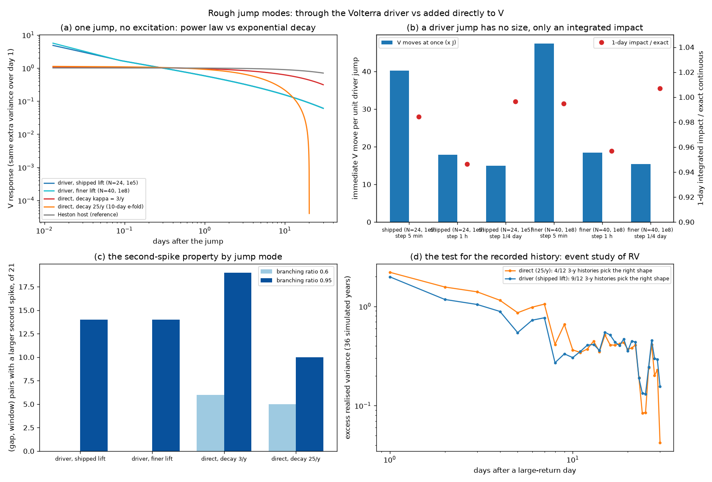

# Rough jump modes

*Driver jumps vs direct jumps: a comparison for your decision. Session H, 15 September 2026.*

## The choice

Session F put Hawkes jumps on the lifted rough Heston host in two ways. Both are
implemented in `models/jump_hosts.py`, and the default is still driver mode.

| | **driver** (current default) | **direct** |
|---|---|---|
| where the jump enters | the Volterra driver, like dt and dW: dU_i = … + J dN | a separate factor: V = v₀ + wᵀU + D, dD = −λ_D D dt + J dN |
| V's response to a jump at s | J · R(t − s), the kernel's resolvent: J t^(α−1) E_α,α(−κ t^α) | J e^(−λ_D (t − s)), plus the factors' reaction to the raised V |
| extra parameter | none (the decay is the kernel's, so H) | λ_D (default κ) |
| still affine? | yes: the same lifted Riccati, jump transform added to F(ψ) | yes: one more factor |

Everything below was measured with `study_jump_modes.py`: κ = 3, θ = 0.04, ξ = 0.3,
H = 0.12. The results are in `captures/jump_modes.json` and the figure is at the end.

## What was measured

### 1. How a jump decays

These are responses to one jump with no excitation. Each is scaled to add the same
variance over its first trading day.

| mode | share of the 30-day impact in the first hour / day / week | V at 5 min ÷ V at 1 day | V at 1 week ÷ 1 day | V at 30 days ÷ 1 day |
|---|---|---|---|---|
| driver, shipped lift (N = 24) | 6.1% / 19.0% / 45.9% | **8.3** | 0.42 | 0.10 |
| driver, finer lift (N = 40) | 6.3% / 19.1% / 46.0% | 9.8 | 0.42 | 0.10 |
| direct, λ_D = κ = 3/y | 1.0% / 6.0% / 26.3% | 1.1 | 0.80 | 0.33 |
| direct, λ_D = 25/y (10-day e-fold) | 2.9% / 17.0% / 62.7% | 1.2 | 0.53 | **−0.05** |
| Heston host (reference) | 0.6% / 3.9% / 19.2% | 1.0 | 0.95 | 0.71 |

**Driver mode** has the shape of an aftershock sequence. It spikes hard within the hour,
falls as a power law, and still carries a tenth of its one-day level after a month.
Power-law relaxation of volatility after crashes (an Omori law) is a documented market
regularity (Lillo & Mantegna, 2003).

**Direct mode is an exponential**, so λ_D alone sets its horizon. At the default λ_D = κ
it barely decays inside a month. At 25/y the response **undershoots**, and V ends up
below its no-jump path after about 20 days. The mechanism: while D is high, mean
reversion pushes the rough factors down. Those factors remember through the kernel
after D has gone. This is a side effect of wiring D into V's drift, not a property
anyone would choose.

### 2. What a driver jump's "size" means

In the exact rough model the kernel is infinite at zero, so a driver jump has no
instantaneous size in V. It only has an integrated impact. On a lift the instantaneous
move is finite, but it depends on the time step and the lift:

| driver jump, per unit J | step 5 min | step 1 h | step ¼ day |
|---|---|---|---|
| V moves at once, shipped lift | **40.2** | 17.8 | 15.0 |
| V moves at once, finer lift | **47.4** | 18.5 | 15.4 |
| 1-day integrated impact, shipped (exact 0.03358) | 0.03305 | 0.03178 | 0.03346 |
| 1-day integrated impact, finer | 0.03340 | 0.03213 | 0.03381 |

A direct jump moves V by exactly J at any step. **Consequence:** in driver mode, J must
be specified, calibrated and reported as integrated variance impact. A statement such
as "V jumps by 0.01" means something different on every grid. The integrated impact is
stable to within 5% across steps and lifts.

### 3. The second-spike property

The question is whether the variance increment after the second of two clustered
shocks is larger than after the first. The test uses the exact superposition identity
from Session F on the same 21 (gap, window) pairs, with quarter-day steps.

| mode | branching ratio 0.6 | branching ratio 0.95 | gaps where it holds |
|---|---|---|---|
| driver, shipped lift | **0 of 21** | 14 of 21 | ½ to 10 days (at 0.95) |
| driver, finer lift | 0 of 21 | 14 of 21 | identical |
| direct, λ_D = 3/y | 6 of 21 | 19 of 21 | ½ to 2 days at 0.6 |
| direct, λ_D = 25/y | 5 of 21 | 10 of 21 | ½ to 2 days at 0.6 |

In driver mode the kernel's early decay beats the excitation unless clustering is
near-critical. Branching ratios near one have been reported for index futures at high
frequency (Hardiman, Bercot & Bouchaud, 2013), so this regime is not exotic. Direct
mode delivers the property at moderate clustering whenever the excitation outruns λ_D.
The lift choice does not affect it.

### 4. Kurtosis (Session F)

Hawkes daily returns are more kurtotic than Poisson in both modes: driver 6.73 ± 0.17 vs
4.43 ± 0.08, direct 8.35 ± 0.21 vs 5.28 ± 0.09, a ratio of about 1.5 in each. The two
modes' jump sizes were not matched in integrated impact there, so the levels are not
comparable across modes. Kurtosis does not separate them.

### 5. Can the data decide?

The planned test runs an event study on the recorded history. It takes daily realised
variance after large-return days and asks whether the excess decays as a power law or
exponentially. Its power was measured on simulated 3-year histories with realistic
settings: Hawkes n = 0.6, about 10 events per history, and jump sizes matched in 1-day
impact.

| truth | right shape wins, single 3-year history | pooled over 36 years |
|---|---|---|
| driver | 9 of 12 | power law (p = 0.59) ✓ |
| direct (λ_D = 25/y) | **4 of 12** | exponential (0.082/day) ✓ |

**One 3-year history cannot decide this.** The test leans toward "power law", which it
reports 8 times out of 12 even when the truth is exponential. A power-law verdict on
SPY would carry a likelihood ratio of about 1.1, which is not evidence. Both modes were
simulated from the same random draws, and their verdicts agree on 11 of the 12
histories. What decides a verdict is the draw, not the mode.

Two routes would decide it:

- **A decade or more of realised variance.** 36 simulated years separated the modes.
  This needs longer history than the recorder's default pull.
- **The option surface after a scheduled shock.** Driver mode says the extra variance
  priced to expiry T after an event grows like (T − t_e)^α, which is concave with no
  ceiling. Direct mode says it saturates at J/λ_D. Chains recorded before and after an
  FOMC day measure exactly that curve, and the 16 September decision falls inside this
  week's recording window. The clock estimator (`calibrate/clock.py`) already fits the
  event step; extending it with a post-event response term is a small change.

## Recommendation

**Keep driver mode as the default**, with three changes and one open check:

1. **Parameterise driver jumps by integrated impact**: variance added over the first
   day, or over the kernel's own horizon. Do not use a V jump size, which depends on the
   grid (section 2).
2. **Do not claim the second-spike property at moderate clustering on the rough host.**
   State its actual condition: branching ratio near one. If the property is a hard
   requirement at n ≈ 0.6, only direct mode delivers it (section 3).
3. **If direct mode is ever used, fix λ_D from data and disconnect D from the factors'
   mean reversion**, or accept the undershoot (section 1).
4. **Run the option-surface test on the September 16 FOMC chains** once recorded. It is
   the most direct measurement available this month that can tell the two modes apart
   (section 5).

Why driver mode: it is the Volterra-consistent choice, and one H then governs both
diffusive roughness and jump relaxation. It adds no parameter, it keeps pricing in the
same Riccati, and its aftershock shape matches the empirical Omori-law literature.
Direct mode is two models glued together, with a decay rate that the rough part does
not know about.

**Your call:** confirm driver as the default, or name the property (second spike at
moderate clustering) that would make direct mode the requirement.

{width=full}
