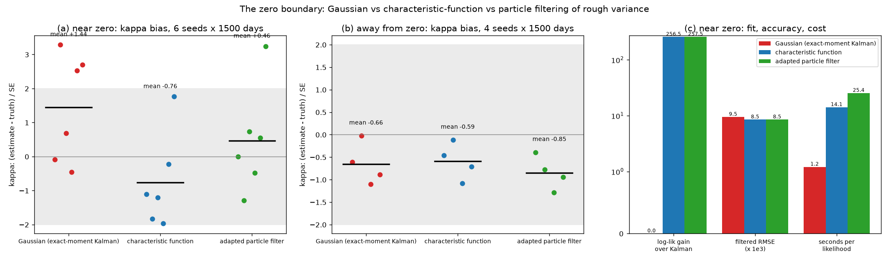

# Particle filter vs characteristic-function likelihood

*Which non-Gaussian filter to adopt for variance at the zero boundary. A comparison for your decision. Session H, 15 September 2026.*

## The problem

Session G left one flag on the rough host. When variance sits exactly at zero on 10–17% of
days (ξ = 0.3, θ = 0.04, κ = 3), the exact-moment Kalman filter's Gaussian
quasi-likelihood is unreliable. Matching two conditional moments is not enough when the
law of tomorrow's variance has an atom at zero. Two non-Gaussian filters were built
today and benchmarked on the same data.

| | **adapted particle filter** (`filters/particle.py`) | **characteristic-function filter** (`filters/fourier.py`) |
|---|---|---|
| idea | simulate the state; weight by the observation | carry the conditional cf of V; Bayes' rule in Fourier space (Bates, 2006) |
| transition law | the QE step itself, with `substeps` per day | exact for the continuous lift: the variance cf solved as a Riccati system |
| observation step | fully adapted: each particle's predictive likelihood in closed form (atom included), resampled on it, V drawn from its exact posterior | exact Fourier integral for p(y); posterior mean and variance of V from the cf's derivatives |
| what is approximated | nothing but Monte Carlo (500 particles; the likelihood estimate is unbiased) | the posterior after each update: V gamma, the factors Gaussian given V |
| randomness | yes: common random numbers and sorted resampling make it reproducible and smooth in the parameters | none: a deterministic, smooth likelihood |
| observations | spot variance (adapted); daily realised variance in the bootstrap version | spot variance only (realised variance needs the joint cf of V and ∫V) |

Both were checked against independent references before the benchmark (`test_nongaussian.py`):

- **Predictive densities.** Both integrate to 1 (0.99995 and 0.99969 near zero).
- **The cf's Riccati.** It matches the exact affine conditional mean and variance to 3e-8.
- **The QE draw.** The particle filter's noise reproduces the QE step draw for draw.

Along the way one numerical bug was found and fixed: an overflow in the particle
filter's exponential-branch density when the conditional mean is tiny.

## Results: 6 seeds near zero, 4 away, 1500 days each

κ was profiled on a grid with θ, ξ and R held at the truth (`study_zero_boundary.py`).

### Near zero (V = 0 on 10–17% of days)

| | exact-moment Kalman | cf filter | adapted particle filter |
|---|---|---|---|
| mean κ̂ (truth 3) | 3.72 | 2.69 | 3.28 |
| κ̂ minus the particle filter's, per seed | −0.04, +1.53, +0.09, −0.03, +1.12, −0.02 | −0.54, −0.38, −0.86, −0.70, −0.35, −0.70 | 0 |
| log-likelihood at the truth, gain over Kalman | 0 | **+256.5** | **+257.5** |
| cf minus particle log-likelihood, per seed | | −2.1, +4.4, −4.1, −1.1, −4.4, +2.0 | |
| filtered-variance RMSE (×10⁻³) | 9.47 | **8.49** | **8.49** |
| 90% band coverage | | 0.91 (moment band) | 0.86 (particle quantiles) |
| seconds per likelihood, machine under load | 1.2 | 14 | 25 |
| per day, measured back to back later, unthrottled (median of 3) | 0.14 ms | 0.63 ms + 0.17 s per parameter set | 2.5 ms (500 particles, 4 substeps) |

**Kalman's κ misses are irregular here.** On 4 of 6 seeds it sits within 0.1 of the
particle filter; on the other 2 it is off by +1.1 and +1.5. On the finer-simulated data
below it reads high on all three seeds. Either way it is not an estimator to use at the
boundary.

**Both non-Gaussian filters see the same data.** They agree on the likelihood to within
the particle filter's Monte Carlo noise, about 3.5 nats per 1500 days, and they filter V
equally well: 10% lower RMSE than Kalman.

**Yet the cf filter's κ̂ is below the particle filter's on every seed**, by 0.6 on
average. That is systematic, not noise. The next section finds where it comes from.

### Away from zero (V never near zero)

All three agree. κ̂ = 2.61, 2.66 and 2.62. Log-likelihoods are within 4 nats of each
other. RMSE matches to 0.03%. Where the Gaussian is right, the non-Gaussian filters
cost 5–18× more for nothing.

## Where the cf filter's low κ comes from

The benchmark data were simulated with 4 QE substeps a day, and the particle filter runs
on exactly that law. The cf filter models the continuous lift. Part of its offset could
therefore be a model mismatch against discretised data, not its gamma approximation.
To separate the two, the same study was repeated on data simulated with **64 substeps a
day**, close to the continuous law, with the particle filter at 4 and at 16 substeps
(`study_zero_boundary_fine.py`):

| κ̂ on 64-substep data | seed 61 | seed 63 | seed 65 | mean | minus particle (16 substeps): mean ± SE |
|---|---|---|---|---|---|
| exact-moment Kalman | 2.94 | 4.21 | 3.81 | 3.65 | **+1.05 ± 0.35** |
| cf filter | 2.39 | 2.19 | 2.82 | 2.47 | **−0.13 ± 0.20** |
| particle filter, 4 substeps | 2.63 | 2.90 | 3.28 | 2.94 | **+0.34 ± 0.18** |
| particle filter, 16 substeps | 2.55 | 2.65 | 2.60 | 2.60 | 0 |

**The offset belonged to the data's law, not to the gamma approximation.** Once the data
follow the continuous lift, the cf filter's κ is within noise of the particle filter
that simulates that law closely (16 substeps). Now the **4-substep particle filter** is
the one that reads high. The particle filter is consistent for exactly the law it
simulates, and at 4 substeps that is the QE discretisation, not the continuous model.
The Kalman filter stays off by about +1 on this data.

Three seeds is a small sample: an offset below about 0.4 in κ cannot be excluded. But
the picture from the main benchmark, a cf filter biased on every seed, did not survive
the change of data. The first run on this data also exposed the particle filter's
overflow bug: one seed's profile had come out with a zero standard error.

{width=full}

## Trade-offs

| | cf filter | adapted particle filter |
|---|---|---|
| likelihood surface | deterministic and smooth: quasi-Newton optimisers, Hessian standard errors | Monte Carlo: smooth enough to profile under common random numbers (second differences under 0.5 nats), not for Hessians |
| accuracy near zero | likelihood and filtering as good as the particle filter; κ within noise of it on continuous-law data | consistent for the law it simulates: enough substeps for continuous-time data |
| model it targets | the continuous lift | the QE-discretised lift; more substeps approach the continuous law at proportional cost |
| cost per likelihood, 1500 days | ~5× Kalman: 0.63 ms a day plus 0.17 s of Riccati per parameter set | ~18× Kalman at 500 particles and 4 substeps; linear in particles × substeps, so ~4× more at 16 |
| realised variance | needs the joint cf of (V, ∫V): a known extension, not built | bootstrap version has it; the adapted step extends in closed form (∫V is linear in the last V) |
| finer lift (N = 40) | Riccati cost linear in N | per-step cost quadratic in N |
| uncertainty bands | from the moment-matched posterior | particle quantiles |

## Recommendation

**For real data, whose law is continuous, make the cf filter the likelihood at the zero boundary. Keep the particle filter as its independent check.**

1. **Default: the exact-moment Kalman filter.** It is right away from zero and 5–18×
   cheaper. Diagnose the boundary with it first: the share of days whose predicted
   variance is within two standard deviations of zero. Above about 5%, switch.
2. **At the boundary: estimate with the cf filter.**
   - It targets the continuous lift, which is the model being fitted.
   - Its likelihood is deterministic and smooth, so quasi-Newton optimisers and Hessian
     standard errors work.
   - It matches the particle filter's likelihood and filtering accuracy.
3. **Confirm with the adapted particle filter at 16 or more substeps** around the cf
   filter's optimum: a profile in κ, and in H when that is learned. The two are
   independent derivations, and disagreement between them is the alarm. Four substeps
   is not enough for continuous-time data (+0.34 in κ above).
4. **Two extensions before the history's realised variance goes through them:**
   - the cf filter needs the joint cf of the day's variance and its integral, which the
     same Riccati machinery gives with one more source term;
   - the adapted particle filter needs the realised-variance observation in its last
     substep, which is closed-form because the day's integral is linear in the last draw.

   Until then, the Kalman realised-variance filter stays the history's estimator, with
   the boundary diagnostic reported next to it.

**Your call:** confirm this policy, or prefer the particle filter as the primary
estimator. That would mean choosing its substep count, and its cost, as a modelling
parameter.

