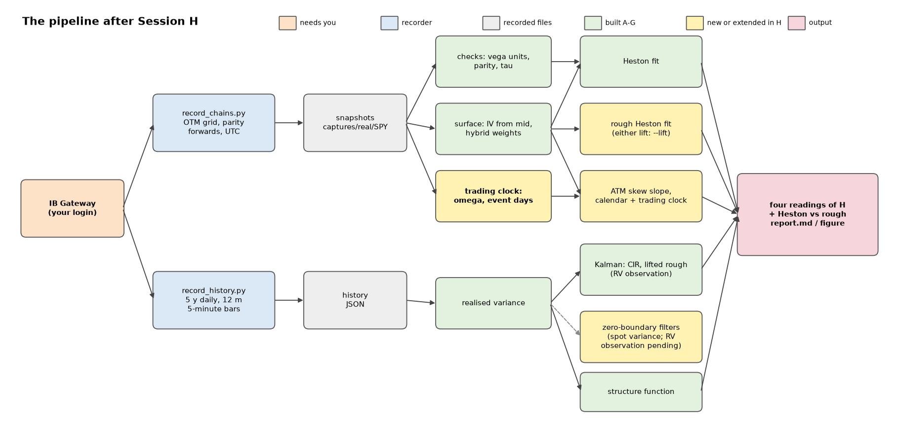

# Status

Eight sessions are complete. Of today's four items, three are done: the zero-boundary
filters, the trading clock, and the health checks. The first, the real-data run, is
waiting on the IB Gateway recording you are doing during your meeting. Everything it
needs is built, tested end to end on synthetic recordings, and ready to run the moment a
file appears under `captures/real/SPY/`.

| | Session G (this morning) | now |
|---|---|---|
| Sessions complete | 7 | **8** (H added) |
| Test suites / pytest items / checks | 11 / 83 / 563 | **13 / 95 / 628** |
| Analytical health checks | 107 / 107 | **117 / 117 (CI)** |
| Comparison documents for your decisions | — | **3, sent** |
| Real data | not recorded | not recorded (your login; US session opens 16:30 Istanbul) |
| Remote | private GitHub backup | private, as you confirmed |

**The three decisions you asked me to prepare** each have a document, already sent:

1. **Finer lift:** adopt it. It removes a −0.006 to −0.009 bias in the calibrated H
   that the shipped lift carries on surfaces with one-day expiries, and hides in the fit
   residuals. The
   cost is about 1.4× per calibration objective and 2× per Kalman step.
2. **Particle filter vs characteristic-function likelihood:** use the **cf filter** as the estimator where variance sits at zero, with the particle filter at 16 or more substeps as its independent check, and Kalman everywhere else. The cf filter's apparent κ bias turned out to be a mismatch with 4-substep simulated data, not a flaw of the filter.
3. **Rough jump modes:** keep driver mode, with jump sizes specified as integrated
   variance impact. The alternative, direct mode, is the only one with a larger second
   spike at moderate clustering, but it undershoots after its jump decays.

**Five corrections today**, all found by today's tests and studies (*Corrections*):

1. The first trading-clock estimator could not see weekends.
2. Snapshot timestamps were written in local time.
3. The particle filter's exponential branch could overflow.
4. The trading-time year was normalised with the wrong weekend share.
5. Christmas Eve was listed as an early close in years where it is the observed holiday.

**One environment note.** For several hours this afternoon the laptop's CPU was held at
33% of its speed, even under load (Windows processor-performance counter): the rough
objective took 3.3 s instead of 0.6 s. It had recovered by the evening, when the cost
comparisons were re-measured. Sustained load throttles this machine, which is worth
knowing before long calibration runs. The fan and vents are worth a check.

# What exists: the pipeline end to end

{width=full}

| layer | modules | what it guarantees, measured |
|---|---|---|
| data | `record_chains.py`, `record_history.py`, `sources/replay.py`, `fake_ib.py` | cycle-isolated request ids; UTC clock; vega per unit vol; delayed ticks; replay round trip exact to 1e-12 |
| surface | `volsurf_core.py`, `volatility_surface_3.py`, `fit/svi.py` | forwards from put-call parity (planted forward to 0.0006% of spot); σ-normalised grid |
| pricing | `pricing/fourier.py`, `models/heston.py` | Lewis pricing against closed forms and Monte Carlo; risk-neutral density to 0.06% of peak |
| rough model | `models/rough_heston.py`, `models/rough_heston_adams.py` | the lift reduces to Heston exactly; prices within 0.15 vp of true rough Heston at 1 day (0.03 vp on the finer lift); stability preconditions raise, never warn; positivity-preserving exact-moment step |
| calibration | `calibrate/objective.py`, `fit.py`, `weights.py` | generic Levenberg–Marquardt; failure is charged, never zeroed; kernel and stability checks after every fit |
| filters | `filters/kalman.py`, `particle.py`, `fourier.py` | Kalman on OU / CIR / lifted rough (spot and realised variance); H learned three ways; non-Gaussian filters at the zero boundary |
| jumps | `models/hawkes.py`, `models/jump_hosts.py` | exact Hawkes simulation and expectations; the second-spike identity exact to 1e-15 |
| time | `volsurf_core.py` (clock), `calibrate/clock.py` | NYSE calendar by rule; variance time; the market's clock estimated from the chain |
| real-data run | `run_real_data.py` | the whole chain above on one command, on either lift (`--lift 40:1e8`) |

# Session H: today's four items

## 1. The first real-data run

**Blocked on the recording, and ready for it.** Nothing was recorded yet at the time of
writing: no IB Gateway process, no API port listening, no file under `captures/real/SPY/`.
Chains can only be recorded meaningfully during the US session, which opens at **16:30
Istanbul**. History can be pulled any time.

What happens when the files appear, in one command (`run_real_data.py`):

1. **Chain checks.** IBKR vega units against Black–Scholes, the IV gap between IBKR's
   model and our τ and forward, and put-call parity per expiry.
2. **Trading clock.** New today: ω and its interval, pooled over the day's snapshots,
   with event days found. The FOMC decision on 16 September should show up as one.
3. **H from the ATM skew slope**, on calendar time and on the measured clock.
4. **Heston and rough Heston fits** on the recorded surface, with their post-fit kernel
   and stability checks.
5. **The history.** Realised variance, the CIR filter, the lifted rough filter with H
   profiled, and the structure function.

Prepared today so the run is not held up:

- **`--lift 40:1e8`** runs the entire pipeline on the finer lift. The two H readings can
  then be compared on the real surface before you decide on adoption.
- **Recorded instants are recovered from the stored taus.** The recorder stored local
  wall-clock time with no offset (*Corrections*), and every short-dated τ in the clock
  depends on this instant.
- **The synthetic run still passes end to end with the clock stage.** The quick
  synthetic chain has only two expiries inside 15 days, so the clock reports
  "not identified" and gives no number.

**Expect on the real data:**

- **The skew-slope H will read low, possibly negative.** On the synthetic surface it
  reads −0.03 against a true 0.10. It is a known biased cross-check (Session G flag 6).
- **The history filter's H will have a wider interval than on synthetic data.** Twelve
  months of 5-minute bars is about 250 days of realised variance, against 500 simulated.

## 2. A non-Gaussian filter for the zero boundary

Two were built, because the two routes fail in different ways:

- **A fully adapted auxiliary particle filter** (`filters/particle.py`). Its transition
  is the QE step. Each particle's predictive likelihood is computed in closed form,
  including the atom at zero, before anything is drawn. Common random numbers and
  sorted systematic resampling make the likelihood reproducible and smooth enough to
  profile.
- **A characteristic-function filter** after Bates (2006) (`filters/fourier.py`). It
  carries the variance cf exactly through the lifted Riccati system, applies Bayes'
  rule in Fourier space, and projects the posterior onto gamma(V) × Gaussian(factors | V).

On 6 seeds × 1500 days with variance at zero on 10–17% of days:

- **Likelihood.** Both gain about **257 nats** over the exact-moment Kalman filter.
- **Filtering.** Both cut the filtered-variance RMSE by **10%**.
- **Agreement.** They agree with each other to within the particle filter's Monte Carlo
  noise.
- **κ.** Kalman's κ estimate misses irregularly: by +1.1 and +1.5 on 2 seeds, near zero
  otherwise. The cf filter's κ reads 0.6 below the particle filter's on every seed.
  On data simulated with 64 substeps, close to the continuous law, that offset vanishes: −0.13 ± 0.20 against a 16-substep particle filter. It was a mismatch with the benchmark's 4-substep data, and now the 4-substep particle filter is the one that reads high (+0.34 ± 0.18).
- **Away from zero** all three agree, and Kalman is 5–18× cheaper.

New suite `test_nongaussian.py` (20 checks): densities integrate to one, the cf's
Riccati matches the exact affine moments, the Gaussian limit holds, the zero-boundary
gain is there, and common random numbers behave.

## 3. A trading-time clock for short-dated options

**The clock** (`volsurf_core.variance_time`):

- **Calendar.** NYSE holidays, including Good Friday via the Easter computation and
  weekend-observed dates, early closes, and daylight saving.
- **Weights.** Each second before expiry is classed as session, overnight or weekend.
  Session seconds count 1; overnight and weekend seconds count ω.
- **Normalisation.** One calendar year always holds one year of variance time, so
  ω = 1 is ACT/365 exactly.

**The estimator** (`calibrate/clock.py`) reads the market's ω from its own chain:

1. ATM total variance is read from prices with τ = 1, so no clock enters it.
2. The model is w_j = a(S_j + ω(O_j + W_j)) + event steps, with S, O and W the session,
   overnight and weekend seconds to expiry.
3. ω is profiled by generalised least squares, with an F-based 95% interval.
4. Event days are detected as steps in total variance.
5. The day's snapshots are pooled.

**Validation on planted clocks:**

- **Noise-free.** Recovered to 1e-4.
- **1–3% noise.** Median within 0.2% of the truth. The 95% interval covers the truth
  90–97% of the time.
- **An FOMC-day step** is found at its expiry in 20 of 20 chains and kept out of ω.
- **Through the recorder.** A fake-exchange recording priced on a planted clock reads
  back ω = 0.2000.

New suite `test_clock.py`: 45 checks, covering published 2022, 2026 and 2027 holiday
calendars, both DST switches, the early-close arithmetic, the estimator and the
snapshot instant.

**On real chains:** not yet measured, since there are no chains. It runs automatically
in the real-data pipeline, and the recorder's default targets give 7 expiries within
15 days, weekends included, which is enough to identify ω.

## 4. Health and sanity checks

- **Health checks.** 10 new, all passing: the cf Riccati against exact moments (1.8e-8),
  both filters against Kalman away from zero (within 1 nat), the zero-boundary gain
  (+58 nats in 400 days), the cf and particle filters' agreement (0.4 nats), the clock's
  ACT/365 identity (exact), the 2026 holiday calendar, the Labor Day weekend's 89.5
  hours, planted-ω recovery, interval coverage (0.95), and the snapshot instant
  (exact). All 117 checks pass on CI and on this laptop, which shows one borderline
  timing-trend flag (appendix).
- **Test suites:** 13 suites, 95 pytest items and 628 checks, all green on GitHub's Linux runners (full tier, 7 min 48 s). The quick tier is also green locally: 70 items, 483 checks.
- **CI:** the full tier was dispatched after the push, and pytest (95 of 95) and the health checks (117 of 117, no trend flags) passed. The quick tier took 1 min 22 s, the full tier with health checks 9 min 10 s.

# The three comparisons

Each was sent as its own PDF (`docs/comparison-*.pdf`). In brief:

## Finer lift (N = 40, fastest node 1e8/y) vs shipped (N = 24, 1e5/y)

- **The kernel.** The shipped lift is under 1% in sup norm from an hour up, but its
  top node caps the kernel below 7 minutes. It misses 21.6% of the driver's variance over
  a day (finer: 5.1%), and at the one-hour scale its paths are twice as smooth as the true
  process (variogram exponent 0.48 against 0.24; finer 0.27).
- **Prices against the true model at one day:** 0.148 vp shipped, 0.034 vp finer (H = 0.12);
  0.185 and 0.038 at H = 0.05.
- **The calibrated H,** on a surface priced by the true model and fitted from the truth:
  shipped 0.1145 for a true 0.12 and 0.0409 for a true 0.05; finer 0.1199 and 0.0498.
  The residuals hide the bias (0.006–0.008 vp). N = 32 at the shipped top node is
  identical to N = 24, so today's refinement rule buys nothing.
- **The history's H** from daily realised variance: unchanged (0.133 / 0.135 ± 0.033 for a
  true 0.12). Daily integration averages the difference away.
- **Cost** (median of three unthrottled runs): objective 0.97 s against 0.68 s (1.41×),
  Kalman step 1.9×, cf filter 1.8×, particle filter 1.3×. Every pricer and
  post-fit stability check passed. The Riccati stability constants should still be
  re-measured on the new lift.
- **Recommendation:** adopt it everywhere, after fitting the first SPY surface on both lifts.

## Particle filter vs characteristic-function likelihood

- **The same data, two filters.** On 6 seeds × 1500 days near zero both gain about
  257 nats over Kalman and filter V 10% better. They agree on the likelihood to within
  the particle filter's Monte Carlo noise.
- **The κ offset.** On the benchmark's 4-substep data the cf filter's κ sat 0.6 below the
  particle filter's on every seed. On 64-substep data it is within noise of a 16-substep
  particle filter (−0.13 ± 0.20), while the 4-substep particle filter reads +0.34 and
  Kalman +1.05. Each filter is consistent for the law it models: the cf filter for the
  continuous lift, the particle filter for its own substep count.
- **Trade-offs.** The cf filter is deterministic and smooth (quasi-Newton, Hessian SEs)
  at about 5× Kalman. The particle filter is Monte Carlo, about 18× Kalman at 4 substeps
  and 4× more at 16, and already handles realised variance in its bootstrap form.
- **Recommendation:** Kalman by default, with a boundary diagnostic. The cf filter
  estimates at the boundary, and the particle filter at 16+ substeps confirms. Both
  need the realised-variance observation before the history goes through them.

## Rough jump modes: driver vs direct

- **Response shape.** A driver jump decays as a power law (19% of its 30-day impact in
  the first day, 10% of its one-day level left at a month). A direct jump decays
  exponentially at a rate the rough part does not know about, and undershoots after
  about 20 days at a 10-day e-fold.
- **Jump size.** A driver jump has no well-defined size in V: 40J at a 5-minute step,
  15J at a quarter-day. Its 1-day integrated impact is stable to 5%.
- **The second spike.** Driver mode has a larger second spike only near-critically
  (0 of 21 pairs at branching 0.6, 14 at 0.95). Direct mode has one at moderate
  clustering (5–6 of 21).
- **Can data decide?** A realised-variance event study on one 3-year history cannot:
  both modes return the same verdict on 11 of 12 simulated histories. The option
  surface around the 16 September FOMC can.
- **Recommendation:** driver mode, parameterised by integrated impact.

# What is known, sessions A–H

The results the pipeline stands on, each measured rather than assumed:

**Surface and data (A–C, G)**

- **Forwards.** Recovered from put-call parity to 0.0006% of spot. Using spot instead
  would miss by 2.19 at 42 days.
- **The strike grid.** A fixed ±2% band spans 4.66σ at half a day and 0.73σ at twelve
  days. On the σ-normalised grid the IV uncertainty spread shrinks from 198,906× to 3.6×.
- **IBKR's traps.** Vega per vol point, delayed greeks on tick 83, request ids reused
  across cycles, and a local clock read as UTC. All four are pinned by tests against
  the TWS stand-in.

**Pricing and the rough model (B, D, G)**

- **Lewis pricing** holds against closed forms and Monte Carlo. It is the default,
  because Carr–Madan needed moments a calibration walked past.
- **The lift is a generalisation of Heston.** One node at x = 0 reproduces closed-form
  Heston to 7e-10. The 24-node lift converges to Heston linearly in ½ − H.
- **Against the true rough Heston** (fractional Adams): 0.15 vp at 1 day on the shipped
  lift, 0.03 vp on the finer lift.
- **Stability.** ETDRK4 and exponential-trapezoidal constants were measured, not taken
  from theory. A solve beyond them raises StabilityError, and |φ| ≤ 1 is enforced
  after every solve.
- **The positivity-preserving exact-moment step** matches brute-force quadrature to
  3.5e-12. It never produces negative variance; Euler did on 13% of days.

**Calibration and identifiability (C, E, G)**

- **What a surface pins down.** Under 0.5 vp noise v0 (3.8%) and ρ (3.7%) are
  identified; κ (34.7%) is not until maturities pass 1/κ.
- **Rough vs vanilla Heston.** On a rough market, rough Heston fits to 0.000 vp.
  Vanilla Heston reaches 0.76 vp only at κ = 35.6, and it cannot produce the skew below
  a week: a 1–3 day slope of −0.12 against the market's −0.44.
- **SE(H) depends on the weighting**, from 0.20 down to 0.02. corr(H, ξ) stays at
  0.92–0.99 under every scheme: structural, not fixable by weights.
- **A lift-induced bias (new today).** On the shipped lift the calibrated H is 0.0055
  low at H = 0.12 and 0.009 low at H = 0.05. The finer lift removes it.

**Filters and roughness from time series (F, G, H)**

- **The Kalman filter** matches closed forms to 1.7e-16. Maximum likelihood through the
  filter removes the AR(1) attenuation bias (κ̂ 61–65 for a true 5).
- **Online learning.** Dual and joint EKFs carry Ljung's bias, up to 2 SE. The recursive
  MLE with full sensitivities stays within 1 SE.
- **Realised variance is an integral.** A spot filter fed realised variance reports
  H ≈ 0.39 for a true 0.10. The integrated-variance filter recovers it.
- **H learned three ways:** profile likelihood 0.133 ± 0.012 for a true 0.12, a bank
  of filters 0.121 ± 0.007, and the recursive MLE 0.119.
- **At the zero boundary** the Gaussian quasi-likelihood fails, and the two
  non-Gaussian filters fix the likelihood (today).

**Jumps (F, H)**

- **The second-spike claim, made exact.** Impossible under Poisson. At short gaps on
  exponential hosts it holds iff α > κ. On the rough host it needs near-critical
  clustering in driver mode.
- **Kurtosis.** The Hawkes/Poisson ratio of excess kurtosis equals the daily Fano
  factor, exactly.

# Corrections (Session H)

1. **The first trading-clock estimator was blind to the thing it measured.** It scored
   a clock by the median absolute deviation of log forward-variance rates between
   neighbouring expiries. Consecutive weekday expiries have identical spans under
   every clock and outvote the weekend spans, which a robust loss treats as outliers.
   On noise-free chains planted at ω = 0.1 it returned 0.187, and at 0.5 it returned
   0.017. It was replaced by the profile GLS above, and the failure is kept as a test.
2. **Snapshots stored local wall-clock time with no offset.** `recorded_at` came from a
   bare `now()`, three hours from UTC on this machine: the Session G τ bug in a new
   place. Every short-dated τ in the clock depends on this instant. It is now written
   in UTC with its offset, and `replay.recorded_utc` recovers the exact instant from the
   stored taus. A timestamp without an offset is refused rather than used.
3. **The adapted particle filter's exponential branch could overflow.** With a tiny
   conditional mean, exp(β²R/2) overflowed while Φ underflowed. The product was NaN,
   which the likelihood charged as −1e6. It appeared on 64-substep data with 16 filter
   substeps, not in the main benchmark. The density is now evaluated in logs with a
   Mills-ratio tail, and checked against direct integration up to β = 1e6.
4. **The variance-time year was normalised with the wrong weekend share.** The first
   cut assumed 252 sessions and 251 overnights. It is now normalised by the actual 2025
   calendar split: 1622.5 session, 3412.5 overnight and 3725 weekend/holiday hours. The
   error was harmless while the two weights were equal.
5. **Christmas Eve was listed as an early close in years where it is the observed
   Christmas holiday**, such as 2027. Sessions were unaffected, because holidays are
   checked first; the list is now correct.

# Decisions for you

Your instruction was to hold the questions until you are back. Here they are, each
with my recommendation.

| # | decision | recommendation | evidence |
|---|---|---|---|
| 1 | Adopt the finer lift (N = 40, top node 1e8)? | **Adopt, everywhere** | comparison PDF; `study_finer_lift.py` |
| 2 | Particle filter or cf-based likelihood at the zero boundary? | **Cf filter to estimate, particle filter (16+ substeps) to confirm, Kalman elsewhere** | comparison PDF; `study_zero_boundary*.py` |
| 3 | Rough jump mode? | **Driver**, sized by integrated impact | comparison PDF; `study_jump_modes.py` |
| 4 | GitHub backup private? | **Done:** stays private, as you said | — |
| 5 | Retire the calibration's N = 32 refinement? | **Yes, if 1 is adopted.** N = 32 at the same top node changed nothing measurable (H bias identical to N = 24 at both H) | `study_finer_lift.py` D1 |
| 6 | Demote the skew-slope H to a diagnostic? | **Yes.** −0.03 on a surface with true H = 0.10; biased by vol-of-vol | synthetic pipeline runs |
| 7 | Record every daily expiry for the clock? | **Not needed.** The default targets give 7 expiries within 15 days. All 11 dailies narrow ω's 95% interval by only a sixth (log-width 0.45 → 0.38 at 2% noise). Pooling a day's snapshots does more: three snapshots narrowed it by 40% in the planted test, with independent noise | planted chains, measured today |

# Recommendations

In order.

1. **Record today, in US hours.** Take several snapshots through the session (every 15
   minutes is the tutorial's setting), and pull the history. Pooling snapshots is what
   pins the clock, and the FOMC on 16 September falls inside this week's chains.
2. **Run the pipeline twice on the first recording:** once on the shipped lift and once
   with `--lift 40:1e8`. Both surfaces and fits land in `captures/real/report/`. The gap
   between the two calibrated H values on SPY is the real-data version of decision 1.
3. **Adopt the finer lift as the default** if the real run agrees with the synthetic
   evidence. Changing it moves numbers that tests pin to N = 24 (K_N(0) = 61.9, the
   kernel error 0.87%, the fastest node's 7 minutes, timings), so it is a deliberate
   re-baselining commit, not a flag flip.
4. **Use the zero-boundary filters where the boundary binds.** Diagnose with the Kalman
   filter first: the share of days whose predicted variance is within two standard
   deviations of zero. Near zero, estimate with the cf filter and confirm with the particle filter at 16 or more substeps.
5. **Close the realised-variance gaps before trusting the history's H:**
   - bipower variation, so price jumps do not inflate realised variance (Session G flag 3);
   - a microstructure-noise check across sampling frequencies;
   - the realised-variance observation in the adapted particle filter, where the day's
     integrated variance is linear in the last draw, so it is a closed-form extension.
6. **The event-premium test** for the jump mode, on chains recorded either side of the
   16 September FOMC.
7. **Then the surface itself:**
   - eSSVI for an arbitrage-free surface by construction (open since Session C);
   - splitting `volatility_surface_3.py`;
   - Hawkes on real event times.

# Risks on real data

- **American exercise.** SPY options are American. Using OTM quotes keeps the
  early-exercise premium small, but deep ITM puts would bias the parity forwards; the
  seed pass only uses near-the-money strikes.
- **The first 15 minutes of the session** have wide spreads. The recorder does not skip
  them by itself; the tutorial starts the day's recording at 17:00 Istanbul (10:00 New
  York) for that reason.
- **One login at a time gets data.** A phone or web session with live data gives error
  10197 and no quotes (tutorial, section 2).
- **Event days on the short end** move ω if they are not found. The detector needs
  about 4 noise standard deviations to add a step, so a small event premium can go
  undetected.
- **Twelve months of 5-minute bars** is about 250 days of realised variance, so H from
  the history will be loose. Five years of daily bars back it up through Garman–Klass,
  which is noisier.

# Appendix: health checks

From the full CI run after today's push, on GitHub's Linux runners (run 34962890361): 117 of 117, no trend flags.

On this laptop, re-run in the evening after the CPU recovered: also 117 of 117, with one trend flag. The rough objective's rolling mean over nine runs is 0.751 s against a 0.75 s target; its last run took 1.07 s, and this machine's timings of that objective range from 0.6 to 1.1 s on unchanged code. During the afternoon throttling the same timing check had failed outright (3.00 s against a 3 s limit), and that run was kept out of the trend history.

**Foundations**

| check | measured | threshold | verdict |
|---|---|---|---|
| norm_pdf vs scipy | `0` | `1.00e-15` | PASS |
| norm_cdf vs scipy | `1.11e-16` | `1.00e-15` | PASS |
| put-call parity C-P = F-K | `8.53e-14` | `1.00e-09` | PASS |
| vega vs central difference | `1.84e-08` | `1.00e-04` | PASS |
| implied-vol round trip | `4.16e-16` | `1.00e-06` | PASS |
| fd_first exact on a quadratic | `7.46e-14` | `1.00e-12` | PASS |
| fd_second on a quadratic vs its rounding floor 2.08e-11 measured, floor 5.06e-11 | `0.41 x floor` | `1 x floor` | PASS |
| shipped 2nd derivative: order on a $1/$5 kink grid Fornberg 5-point; mapped-coordinate idea measured at 0.01 | `3.077` | `2` | PASS |
| 3-point stencil order on the same grid (kept for contrast) the documented first-order loss | `1.086` | `1.5` | PASS |

**Heston cf**

| check | measured | threshold | verdict |
|---|---|---|---|
| phi(0) = 1 | `0` | `1.00e-12` | PASS |
| phi(-i) = 1 (martingale) | `0` | `1.00e-10` | PASS |
| phi(-u) = conj(phi(u)) | `0` | `1.00e-12` | PASS |
| \|phi(u)\| <= 1 | `0.9999` | `1` | PASS |
| branch continuity, shipped (max/median step) Albrecher g=(a-d)/(a+d) | `5.242` | `50` | PASS |
| branch discontinuity, reciprocal form the trap, kept to prove it is real | `2825` | `500` | PASS |
| trap / shipped separation | `538.9 x` | `100 x` | PASS |
| xi -> 0 degenerates to Black-Scholes at xi=1e-8, cancellation-free form; was 5.9e-09 at xi=1e-4 | `1.39e-16` | `1.00e-14` | PASS |
| naive-form cancellation at xi=1e-6 (kept to prove it) shipped form is 5.7e-13 at the same xi | `3.44e-05` | `1.00e-06` | PASS |

**Pricers**

| check | measured | threshold | verdict |
|---|---|---|---|
| Lewis vs exact Black-76 | `3.55e-15` | `1.00e-10` | PASS |
| Carr-Madan vs exact Black-76 | `1.94e-16` | `1.00e-10` | PASS |
| Lewis vs Carr-Madan on Heston independent routes, 5 maturities | `5.07e-15` | `1.00e-08` | PASS |
| Carr-Madan insensitive to damping alpha alpha 0.75 to 3.0 | `6.11e-16` | `1.00e-08` | PASS |
| Fourier vs Monte Carlo (sigmas) residual is Euler O(dt) bias | `0.3618 sd` | `5 sd` | PASS |
| simulated E[S/F] = 1 | `1.94e-06` | `6.12e-04` | PASS |
| risk-neutral density mass | `1` | `1` | PASS |
| risk-neutral density mean = forward | `1` | `1` | PASS |
| density non-negativity (min/peak) tail dither scales as 1/dK^2 | `-1.03e-09` | `-1.00e-07` | PASS |
| sampling density: min >= eps and mass = 1 floored 614 pts, removed -5.1e-10 of mass | `1.11e-16` | `1.00e-12` | PASS |

**Estimators**

| check | measured | threshold | verdict |
|---|---|---|---|
| H from ATM skew (planted 0.12) r2 = 1.00000 | `0.12` | `0.12` | PASS |
| H from structure function, worst of 4 planted H = 0.10, 0.12, 0.30, 0.50 | `0.0062` | `0.03` | PASS |
| two independent H routes agree surface route vs path route | `0.002891` | `0.05` | PASS |
| forward from put-call parity r2 = 1.000000, no rate or dividend input | `1.14e-13` | `1.00e-06` | PASS |
| discount factor from parity | `1.11e-16` | `1.00e-09` | PASS |
| SVI parameter recovery | `1.43e-08` | `0.001` | PASS |
| SVI slice passes Durrleman g_min over data = 0.2297 | `1` | `1` | PASS |
| butterfly audit: false positives on a convex slice | `0` | `0` | PASS |
| butterfly audit: catches a planted dent flags the dent's neighbours | `2` | `1` | PASS |
| calendar audit: clean on monotone w | `0` | `0` | PASS |
| calendar audit: catches a reversal | `3` | `1` | PASS |

**Calibration**

| check | measured | threshold | verdict |
|---|---|---|---|
| plant-and-recover, worst relative error 7 iters, 0.4s | `3.12e-11 rel` | `0.01 rel` | PASS |
| fitted RMSE on clean data | `4.06e-09 vol pts` | `0.001 vol pts` | PASS |
| Jacobian condition number at the solution high = parameters trade off; see identifiability | `30.05` | `1.00e+08` | PASS |
| spread of v0 under 0.5vp noise stable | `3.775 %` | `10 %` | PASS |
| spread of kappa under 0.5vp noise unidentified | `34.73 %` | `50 %` | PASS |
| spread of theta under 0.5vp noise stable | `2.803 %` | `50 %` | PASS |
| spread of xi under 0.5vp noise loose | `19.13 %` | `50 %` | PASS |
| spread of rho under 0.5vp noise stable | `3.73 %` | `10 %` | PASS |
| spread of kappa with a Tikhonov prior (weight 50) prior from a history or a variance swap | `0.07281 %` | `10 %` | PASS |

**Markovian lift**

| check | measured | threshold | verdict |
|---|---|---|---|
| K(t) = int e^-xt mu(dx) representation mu(dx) = x^-a / (Gamma(a)Gamma(1-a)) dx, a = H+1/2 | `6.67e-10 rel` | `1.00e-08 rel` | PASS |
| kernel error, N=24, t in [1 day, 2 y] max relative; H = 0.12 | `0.008697 rel` | `0.01 rel` | PASS |
| kernel error on [1 hour, 2 y] a one-day option lives here; 12% below 5 minutes | `0.008697 rel` | `0.01 rel` | PASS |
| kernel error, N=24, worst over H in [0.08, 0.5] H = 0.05: 0.0105, H = 0.02: 0.0113 -- above 1% | `0.00972 rel` | `0.01 rel` | PASS |
| kernel error, N=32, worst over the whole H box [0.02, 0.5] what calibration refits with when a fit lands below H = 0.08 | `0.006656 rel` | `0.01 rel` | PASS |
| Laplace-domain error, z in [0.1, 100] (plan: 1%, see note) 3.5% is the memory beyond 2 y; 1% is not reachable with a 2 y fit | `0.03508 rel` | `0.05 rel` | PASS |
| Laplace-domain error on the pricing band z in [1, 100] a year down to a few days | `0.01419 rel` | `0.03 rel` | PASS |
| lifted recursion == SOE convolution (identity) | `4.05e-14` | `1.00e-12` | PASS |
| lifted path vs true-kernel Volterra path (L2, same noise) | `0.008001 rel` | `0.01 rel` | PASS |
| N=1 at x=0 reproduces closed-form Heston (ETDRK4, 200 steps) | `7.09e-10` | `1.00e-09` | PASS |
| full N-node lift at H = 0.4999 vs Heston shrinks 10x per decade of (1/2 - H) | `1.64e-05` | `1.00e-04` | PASS |
| ETDRK4 vs implicit trapezoidal + Richardson (H=0.12) independent time-steppers, 1 d / 30 d / 1 y | `3.79e-06` | `5.00e-06` | PASS |
| rough objective evaluation, 10 expiries x 13 strikes best of 3 (all: 0.55, 0.54, 0.54); trend target: rolling mean <= 0.75 s | `0.5439 s` | `3 s` | PASS |

**Rough robustness**

| check | measured | threshold | verdict |
|---|---|---|---|
| exptrap at 120 steps, u to 1200, guards off (NOT unconditionally stable) \|phi(u - i/2)\| must be <= 1; kept to prove the constraint | `1.21e+36` | `1` | PASS |
| stability constants enforced: the same solve raises StabilityError hard precondition since Session G; \|phi\| <= 1 is a hard postcondition | `1` | `1` | PASS |
| stability-sized exptrap, same u range: max \|phi(u - i/2)\| 383 steps | `0.9988` | `1` | PASS |
| runaway parameters: maturities priced in-band (of 4) Carr-Madan returned 1.9e18 / 2.9e28 at 30 / 90 d here | `4` | `4` | PASS |
| unpriceable quote: minimum charge (vol) vs 0 before exact fit costs 1.4e-22 | `4.754` | `4.754` | PASS |

**Rough identifiability**

| check | measured | threshold | verdict |
|---|---|---|---|
| SE(H), 20 quotes, equal weights, 0.5 vp noise | `0.04711` | `0.06` | PASS |
| SE(H), same quotes, vega^2 weights H not identified: the weights discard the short end | `0.2024` | `0.15` | PASS |
| corr(H, xi) at the truth the rough analogue of kappa/theta | `0.9776` | `0.9` | PASS |

**Hawkes**

| check | measured | threshold | verdict |
|---|---|---|---|
| mean rate vs mu/(1-n), in SE 12.457 vs 12.5 | `0.5936 SE` | `3 SE` | PASS |
| count variance / Hawkes (1971) closed form, 0.25 y Fano 5.93 | `1.019` | `0.15` | PASS |
| MLE plant-and-recover, worst \|z\| | `1.004` | `3` | PASS |
| time rescaling KS p, Hawkes fit (should pass) | `0.5838` | `0.01` | PASS |
| time rescaling KS p, Poisson fit to the same events clustering is detected, not assumed | `0` | `1.00e-06` | PASS |
| second spike: superposition identity, 4 hosts inc2 - inc1 = r(d+W) - r(d) | `8.88e-16` | `1.00e-12` | PASS |
| Heston: property switches on at alpha = kappa (1.03 kappa) at 0.97 kappa: -2.1e-06 | `1.38e-06` | `0` | PASS |
| rough (driver jumps): pairs with the property at n = 0.6 14 of 21 at n = 0.95 -- needs near-critical clustering | `0` | `0` | PASS |
| kurtosis vs scale-mixture closed form, in SE 5.73 vs 5.59; ratio to Poisson = daily Fano | `0.7597 SE` | `4 SE` | PASS |

**Kalman**

| check | measured | threshold | verdict |
|---|---|---|---|
| fast scalar path vs generic matrix filter | `0` | `1.00e-12` | PASS |
| RMSE improvement minus steady-state theory 45.6% vs 45.2% | `0.3392 pts` | `2 pts` | PASS |
| lecture AR(1) kappa on noisy quotes / true kappa attenuation bias; MLE through the filter is unbiased | `12.6 x` | `2 x` | PASS |
| dual vs joint EKF agreement | `0.129 %` | `1 %` | PASS |
| recursive MLE (Ljung) distance from the MLE Wan-Nelson dual: 0.07 SE | `0.2287 SE` | `1 SE` | PASS |
| strict: steps to re-converge after the regime change bad-print excursion 2.0x normal error | `18` | `2` | PASS |
| adaptive: bad-print excursion (x normal error) re-converges in 0 steps | `14.92 x` | `6.044 x` | PASS |
| robust: steps to re-converge (and ignores the print) excursion 1.7x vs strict 2.0x | `1.5` | `2` | PASS |
| lifted rough filter: RMSE improvement over quotes 24 lifted factors as the state, rank-one Q | `39.67 %` | `30 %` | PASS |

**Recording (real data)**

| check | measured | threshold | verdict |
|---|---|---|---|
| tau: 17:00 Istanbul to next close, hours a naive local clock gave 27 h (fixed in Session G) | `30 h` | `30 h` | PASS |
| US close in UTC follows daylight saving | `1` | `1` | PASS |
| delayed greeks (tick 83) recorded, vega per 1.00 vol IBKR sends vega per vol point | `1 x` | `1 x` | PASS |

**Positivity (Session G)**

| check | measured | threshold | verdict |
|---|---|---|---|
| QE step: mean vs exact conditional mean, in SE variance -0.27% vs exact; min V 2.7e-11 | `0.02983 SE` | `4 SE` | PASS |
| quadrature of the integrated-variance moments | `1.07e-15 rel` | `1.00e-12 rel` | PASS |
| rough variance simulated 3000 days: minimum Euler at the same parameters: below zero on 13% of days | `-6.94e-18` | `-1.00e-12` | PASS |
| exact-moment filter: QML kappa bias away from zero, mean z near zero a Gaussian quasi-likelihood is unreliable (open flag) | `0.6433 SE` | `2 SE` | PASS |

**Lift fidelity (Session G)**

| check | measured | threshold | verdict |
|---|---|---|---|
| 7-day IV, lift N=24 vs true rough Heston (fractional Adams) 1 day: 0.15 vp, skew -1.6% (study_lewis_isometry.py) | `0.0634 vp` | `0.1 vp` | PASS |
| Ito isometry of the lift at 1 day, shortfall vs true kernel 93% of it from lags under 7 minutes; prices integrate it away | `21.6 %` | `25 %` | PASS |

**H weighting (Session G)**

| check | measured | threshold | verdict |
|---|---|---|---|
| SE(H): inverse variance / vega^2 0.0749 -> 0.0076 | `0.1018 x` | `0.25 x` | PASS |
| worst-case RMS error in H: hybrid (anchors x25) inverse variance 0.087, vega^2 0.098 | `0.03783` | `0.08654` | PASS |
| min \|corr(H, xi)\| over all schemes and designs structural: re-weighting cannot remove it | `0.9219` | `0.9` | PASS |

**Learning H (Session G)**

| check | measured | threshold | verdict |
|---|---|---|---|
| filter profile likelihood: \|H_hat - 0.12\| in SE H_hat 0.133 +/- 0.012, xi re-fitted at each H | `1.051 SE` | `3 SE` | PASS |
| log-likelihood of H = 0.49 against the best H Heston-like roughness rejected with xi free | `-266` | `-20` | PASS |

**Zero boundary (Session H)**

| check | measured | threshold | verdict |
|---|---|---|---|
| variance cf (Riccati) vs exact affine mean and variance, 1 day two derivations: the CF filter's Riccati and the eigen-coordinate moments | `1.78e-08 rel` | `1.00e-06 rel` | PASS |
| away from zero, 400 days: both filters' log-likelihood vs Kalman CF -0.34, particle -1.02: nothing to gain where the Gaussian is right | `1.021 nats` | `3 nats` | PASS |
| near zero (V = 0 on 14% of days): particle log-likelihood gain over Kalman 400 days; 257 nats per 1500 days over 6 seeds (study_zero_boundary.py) | `58.25 nats` | `20 nats` | PASS |
| near zero: CF filter vs particle filter log-likelihood they agree on the likelihood; the cf filter's low kappa on 4-substep data was a mismatch with the data's law, not the filter (study_zero_boundary_fine.py) | `0.3773 nats` | `6 nats` | PASS |

**Trading clock (Session H)**

| check | measured | threshold | verdict |
|---|---|---|---|
| variance time at omega = 1 vs ACT/365 | `0 rel` | `1.00e-12 rel` | PASS |
| NYSE 2026 holidays by rule vs the published calendar days in one list only | `0` | `0` | PASS |
| Labor Day weekend: Friday close to Tuesday open | `89.5 h` | `89.5 h` | PASS |
| planted omega = 0.2 recovered from a noise-free chain | `0 rel` | `1.00e-04 rel` | PASS |
| 95% interval coverage, 20 chains with 2% noise profile GLS with an F(1, dof) cut | `0.95` | `0.85` | PASS |
| snapshot instant recovered from the taus (local timestamp ignored) snapshots before Session H stored local time with no offset | `0 s` | `0.001 s` | PASS |

**Engineering**

| check | measured | threshold | verdict |
|---|---|---|---|
| scipy modules on the live import path scipy.stats alone costs 5.8 s | `0` | `0` | PASS |
| startup to actionable error, no TWS was 9.6 s before lazy imports | `0.1395 s` | `3 s` | PASS |
| calibration objective evaluation 39 quotes; 470 ms before vectorising | `9.022 ms` | `200 ms` | PASS |
| Gauss-Legendre rules constructed 2 reuses; leggauss is O(n^2) | `1` | `1` | PASS |
| quadrature tolerance 1e-12 vs 1e-14 calibration runs at 1e-12, ~2x faster | `0` | `1.00e-12` | PASS |
| replay round-trip fidelity recorded vs replayed surface points | `0` | `1.00e-12` | PASS |

117 of 117 checks pass (46s).
