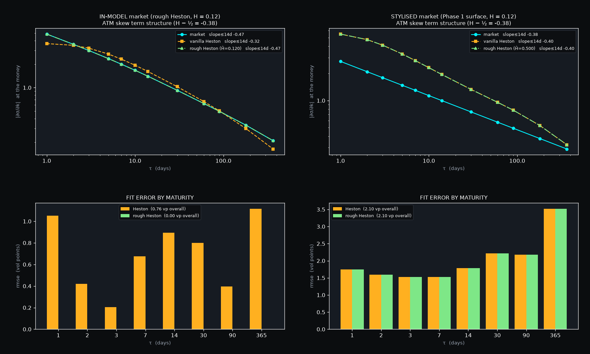
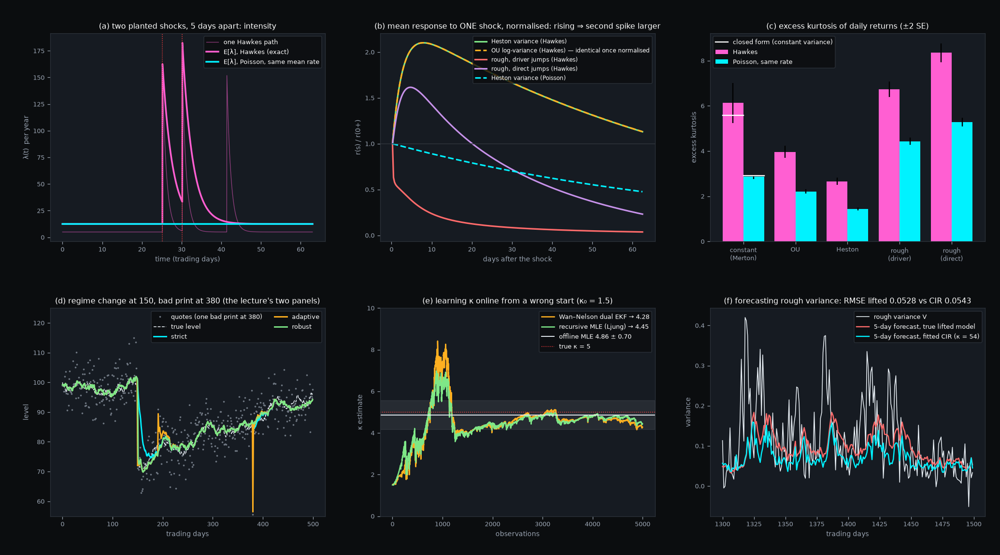

# Status

All six planned sessions are complete. Since the last report (Sessions A–C,
10 September), your analytics review has been worked through item by item. The
Markovian lift of rough Heston is built and validated (Session D); rough Heston is
calibrated and compared with vanilla Heston (Session E); and Hawkes jump arrivals
and Kalman filtering are each attached to three volatility hosts (Session F).

| | Sessions A–C (10 Sep) | now |
|---|---|---|
| Sessions complete | 3 of 6 | **6 of 6** |
| Test suites | 6 | 10 |
| Tests passing | 274 / 274 | **487 / 487** |
| Analytical health checks | 50 / 50 | **90 / 90** (29 s) |
| Production lines | 2,268 | 6,475 |
| Test lines | 1,641 | 3,634 |
| Commits | 15 | 26 |
| Python / numpy | 3.12.3 / 2.5.2 | 3.12.3 / 2.5.2 |

The repository is local-only. No remote, nothing pushed.

Three things in this report overturn or qualify earlier statements, and they are
collected in *Corrections* near the end rather than scattered: a stability claim
made in Session D, a headline number from Phase 1, and several plan targets that
turned out to be unattainable at the stated sample sizes.

# The analytics review

Each item from your review, with what was done. In one case your proposed method
was implemented and measured to fail, and something else was shipped.

**Heston characteristic function as ξ → 0.** Done, as exact identities rather than
only a Taylor branch. `(a−d)(a+d) = −ξ²(u²+iu)` makes `(a−d)/ξ²` exact with no
cancellation. The logarithm becomes `log1p` of an O(ξ²) quantity, evaluated by an
accurate complex `log1p` (numpy's is not accurate for small arguments), with your
Taylor series below ξ = 1e-4. The two branches agree to 3e-16. Against the exact
Black–Scholes characteristic function the error is now **2e-16 at ξ = 1e-8, 1e-10
and 1e-12**, where the literal form is 19%, 100% and 100% wrong. The literal form
is kept as `char_func_naive` so the cancellation is measured, not described.

**Second derivatives on non-uniform strike grids.** Your proposal — map the grid
through a coordinate x = f(K), differentiate uniformly in x, chain-rule back — was
implemented and measured (`debug_fd_methods.py`, orders from doubling against the
exact lognormal density):

| grid | 3-point | mapped 3-point | log-map | Fornberg 5-point |
|---|---|---|---|---|
| smooth stretch | 2.00 | 2.00 | 1.99 | 3.99 |
| geometric | 2.00 | 2.00 | 2.00 | 3.98 |
| $1 / $5 kink (SPY-like) | 1.07 | **0.01** | 0.87 | **3.06** |
| random spacing | 0.84 | −0.12 | 0.84 | 2.76 |

The mapping is second order only when K(x) is itself smooth. At a kink its
numerically differenced metric K″ is O(1) wrong, and the method does not converge
at all. On smooth grids the plain stencil is already O(h²), because h₂ − h₁ is O(h²)
there. Shipped instead: a five-point local polynomial (Fornberg weights), exact for
quartics on any grid. The Breeden–Litzenberger error against the analytic density
fell from 7.9e-8 to 5.3e-12. The 2.08e-11 the old health check reported was
rounding (floor 5.1e-11), not truncation, and the check now says so.

**Density non-negativity.** `density_for_sampling` floors at machine epsilon,
renormalises to unit mass, and reports how much negative mass it removed. It is a
separate function on purpose: the raw density keeps its sign, because a negative
density is the arbitrage signal the panel exists to show.

**κ identifiability.** The 50% threshold was not tightened. The calibrator takes a
Tikhonov prior, in units of "a 100% deviation costs as much as λ quotes each one
standard error off". The prior's cost is reported separately from the data cost, so
a prior that disagrees with the market is visible. Under 0.5 vol-point noise the κ
spread across seeds fell from 34.7% to 0.07% with unchanged fit quality.
`kappa_from_variance_swap` supplies the external pin you suggested.

**Monitoring over runs.** Every health-check run is appended to a history, and
`--trend` reports mean, standard deviation and a drift z-score per check, with your
rules for the Jacobian condition number (median < 100, spikes > 10⁴) and the
clean-data RMSE (rolling mean < 5e-9). The RMSE rule was first written 100× too
loose and has been fixed. On its first real run the drift monitor flagged the
rough-objective speed-up (0.94 s → 0.60 s, z = −21), a genuine step change,
correctly caught.

**The fBm fixture bug** (`docs/fbm_helper_bug.md`, reproduced by
`debug_fbm_helper.py`, debugged once for your pass).
- **Symptom.** The Session A helper sampled the singular kernel `(t−s)^(H−½)` at the
  right end of each cell, capping the weight of the newest shock at 1. Increments came
  out with lag-1 autocorrelation −0.18 against the −0.41 fractional Gaussian noise
  requires, and the structure function read **H = 0.26 for a planted 0.12**.
- **Diagnosis.** Using cell means instead gets to 0.17. Treating the singular first
  cell exactly (the Bennedsen–Lunde–Pakkanen hybrid scheme) gets 0.1207. It is not
  the non-stationary start: dropping 20,000 samples moves the estimate by 0.0004.

**Scope correction.** Hawkes arrivals, the Kalman filter and the dual Kalman filter
are not OU-specific. Each is built once and run on the OU, classical Heston and
lifted rough Heston hosts. Corrected in the previous report and in the plan.

# Numerical methods

## New in Sessions D–F

**Completely monotone kernel and its lift.** `K(t) = t^(α−1)/Γ(α)`, α = H + ½, is
the Laplace transform of `μ(dx) = x^(−α)/(Γ(α)Γ(1−α)) dx`. A quadrature of μ by cell
mass and cell mean (the Abi Jaber–El Euch construction) gives `K(t) ≈ Σ wᵢ e^(−xᵢt)`.
The first cell starts at zero, so the long-memory mass is kept. The range [0.1, 10⁵]
with N = 24 reproduces K to **0.87% on [1 hour, 2 years]**; the published
`r_n = 1 + 10n^(−0.9)` rule measured 27% on the same range. Each factor
`Uᵢ = ∫ e^(−xᵢ(t−s)) dZ` is an OU process, so the rough variance becomes a
24-dimensional Markov system.

**Lifted Riccati system.** The characteristic function is exp of the solution of N
coupled Riccati ODEs, derived by Itô on the affine ansatz. With N = 1 and x = 0 it is
Heston's own Riccati pair. Two independent time-steppers solve it:
- **ETDRK4** (Cox–Matthews), fourth order: measured 3.99–4.05 against closed-form
  Heston.
- **Exponential trapezoidal rule, implicit in the non-linearity.** The implicit
  equation is a scalar quadratic per u with a closed-form root. Second order, fourth
  with Richardson extrapolation.

Both treat the linear part exactly, so the fast factors (x up to 10⁵) cost nothing.
The φ-functions use their series below |c| = 0.1, where the direct formulas cancel.

**Stability constants, measured.** Both schemes are stable only below a step set by
`z = h^α/Γ(1+α) · (ξ(1+|ρ|)|u| + κ)`: ETDRK4 at about 2.65, the implicit scheme
between 15 and 25. Step counts are sized from these (2 and 12 used). The rough kernel
makes both far stricter than for Heston, because h^α ≫ h at small h.

**Lewis contour with checked solves.** The rough pricer evaluates the characteristic
function on Im u = −½, which needs only E[S^½], finite for every martingale model.
That makes `|φ(u − i/2)| ≤ 1` a hard invariant, and every solve is checked against it.
The difference between the M- and 2M-step solves serves as an instability detector:
a stable solve differs at ~1e-7, an unstable one at O(1). The u-grid uses Gauss–Legendre
panels that double in width (2,176 → 640 nodes at one day), and the tail is read at the
cut-off.

**Implementation detail that mattered.** OpenBLAS spent about 1.3 ms per ODE step
starting threads for 24 × n matrix products. The contractions now use einsum below
1,000 nodes and matmul above, and the rank-3 update is a single pre-stacked
real-times-complex product. Result: 6–13× faster per step.

**Objective with honest failure.** Quotes the model cannot price are charged at the
implied-vol ceiling (500%), so failing can never lower the cost. Quotes below
resolution in *both* market and model still contribute zero.

**Standard errors of calibrated parameters.** Gauss–Newton covariance at the truth,
in sandwich form when the fit weights and the noise disagree. This is what answered
"is H identified by this surface?"

**Hawkes process.**
- **Simulation:** exact Ogata thinning, vectorised across paths, with planted events
  and burn-in to stationarity.
- **Closed forms:** stationary intensity μ/(1−α/β); count variance from Hawkes (1971);
  expected intensity after planted events, whose excess decays at β − α.
- **Estimation:** maximum likelihood by the O(n) recursion (Ozaki), with
  observed-information standard errors.
- **Goodness of fit:** the time-rescaling theorem with a Kolmogorov–Smirnov test.

**Exact expectations for jump hosts.** Every host's conditional mean is linear in its
state and in the arrivals, and expected events per step have a closed form. So the
noise-free discrete update gives the Monte Carlo's expectation exactly: no
discretisation gap between simulation and analysis.

**Kalman filtering on three state spaces.** One linear-in-the-state filter (Joseph
form):
- **OU:** your lecture's filter exactly.
- **CIR:** state-dependent process noise, i.e. quasi-maximum-likelihood.
- **Lifted rough Heston:** the 24 factors as the state, with rank-one process noise
  `ξ² V Δt g gᵀ`.

A pure-float path for one-dimensional states is 25× faster and identical to rounding.

**Adaptive filtering.** Additive covariance matching along the direction shocks enter
the state. The multiplicative version divided by an innovation variance that collapses
to 10⁻²⁰ when the rough variance touches zero. A persistence-gated robust variant
treats one large innovation as a bad print (Huber-style) and a run of same-signed
ones as a regime change.

**Parameter learning, four routes.**
- **Offline:** maximum likelihood through the filter.
- **Online, Wan–Nelson:** the dual EKF with recurrent derivatives.
- **Online, joint:** the augmented-state EKF.
- **Online, recursive MLE:** full sensitivity equations for x, P and the gain, with
  Gauss–Newton steps on the innovation likelihood. This is the correction Ljung (1979)
  showed is needed for consistency.

**Forecast comparison.** Diebold–Mariano with Newey–West variance.

## Carried over from Sessions A–C

Black-76 in the forward measure; implied vol by Newton on vega with a bisection
guard; forward from put–call parity regression; raw SVI by the Zeliade reduction;
the Heston characteristic function with the Albrecher branch; Lewis and Carr–Madan
with composite Gauss–Legendre; Levenberg–Marquardt with bounded-logistic transforms;
Breeden–Litzenberger; the structure function and ζ(q) = qH; full-truncation Euler;
Davies–Harte circulant embedding. Details in the previous report.

## Planned or open

- Learning H itself inside the filter. H defines the lifted factors, so a parameter
  filter that moves it changes what the state means.
- A positivity-preserving scheme for rough variance. The lifted Euler scheme lets V go
  below zero, and that biases QML κ (see *Key results*).
- Hawkes estimation from real jump times, and the nearly unstable Hawkes → rough
  volatility limit as a model rather than a citation.
- eSSVI, arbitrage-free by construction across slices.

# Literature and resources

Methods below were implemented from their published constructions. Apart from
Shevchenko (2014), retrieved on 10 September, the papers were not downloaded into
`docs/reference`.

## Used in Sessions D–F

- Abi Jaber & El Euch, *Multifactor approximation of rough volatility models*,
  SIAM J. Financial Math. (2019): cell-mass / cell-mean nodes for the lift.
- El Euch & Rosenbaum, *The characteristic function of rough Heston models*,
  Math. Finance (2019): the fractional Riccati equation the lifted system approximates.
- Cox & Matthews, *Exponential time differencing for stiff systems*, J. Comput.
  Phys. (2002): ETDRK4.
- Lewis, *A simple option formula for general jump-diffusion and other exponential
  Lévy processes* (2001): the Im u = −½ contour.
- Andersen & Piterbarg, *Moment explosions in stochastic volatility models*,
  Finance & Stochastics (2007): why Carr–Madan's damped contour failed during a fit.
- Fornberg, *Generation of finite difference formulas on arbitrarily spaced grids*,
  Math. Comp. (1988).
- Bennedsen, Lunde & Pakkanen, *Hybrid scheme for Brownian semistationary processes*,
  Finance & Stochastics (2017): the exact first cell in the fBm bug diagnosis.
- Hawkes, *Spectra of some self-exciting and mutually exciting point processes*,
  Biometrika (1971): the count variance.
- Ogata, *On Lewis' simulation method for point processes*, IEEE Trans. Inf. Theory
  (1981): thinning.
- Ozaki, *Maximum likelihood estimation of Hawkes' self-exciting point processes*,
  Ann. Inst. Stat. Math. (1979).
- Brown, Barbieri, Ventura, Kass & Frank, *The time-rescaling theorem and its
  application to neural spike train data analysis*, Neural Computation (2002).
- Kalman (1960); your lecture notes for the OU state space, the gain, and strict versus
  adaptive filtering.
- Mehra, *Approaches to adaptive filtering*, IEEE TAC (1972): covariance matching.
- Wan & Nelson, *Dual extended Kalman filter methods*, in Haykin (ed.), *Kalman
  Filtering and Neural Networks* (2001).
- Ljung, *Asymptotic behavior of the extended Kalman filter as a parameter estimator
  for linear systems*, IEEE TAC (1979), and Ljung & Söderström, *Theory and Practice of
  Recursive Identification* (1983).
- Diebold & Mariano, *Comparing predictive accuracy*, JBES (1995); Newey & West (1987).
- Shevchenko, *Fractional Brownian motion in a nutshell* (2014): Wood–Chan positive
  definiteness, and the filtered-variation H estimator (not yet implemented).

## To be used

- El Euch, Fukasawa & Rosenbaum, *The microstructural foundations of leverage effect
  and rough volatility*, Finance & Stochastics (2018), and Jaisson & Rosenbaum (2016).
  Nearly unstable Hawkes processes converge to rough volatility, which is the
  theoretical counterpart of the Session F finding that the second-spike property on
  rough Heston needs near-critical clustering.
- Aït-Sahalia, Cacho-Diaz & Laeven, *Modeling financial contagion using mutually
  exciting jump processes*, JFE (2015): Hawkes jumps in asset prices, for estimation
  on real data.
- de Jong (2000) and Chen & Scott (2003) on quasi-maximum-likelihood Kalman filtering
  of square-root models, relevant to the positivity-floor bias.
- Bayer, Friz & Gatheral, *Pricing under rough volatility* (2016).

# Health and sanity checks

Run with `python healthcheck.py` (`--trend` adds the run history). The suites assert
that behaviour is correct; this reports the numbers behind those assertions.

**Foundations**

| check | measured | threshold | verdict |
|---|---|---|---|
| norm_pdf vs scipy | `0` | `1.00e-15` | PASS |
| norm_cdf vs scipy | `2.22e-16` | `1.00e-15` | PASS |
| put-call parity C-P = F-K | `2.84e-14` | `1.00e-09` | PASS |
| vega vs central difference | `4.23e-09` | `1.00e-04` | PASS |
| implied-vol round trip | `8.05e-16` | `1.00e-06` | PASS |
| fd_first exact on a quadratic | `7.46e-14` | `1.00e-12` | PASS |
| fd_second on a quadratic vs its rounding floor 2.08e-11 measured, floor 5.06e-11 | `0.41 x floor` | `1 x floor` | PASS |
| shipped 2nd derivative: order on a $1/$5 kink grid Fornberg 5-point; mapped-coordinate idea measured at 0.01 | `3.077` | `2` | PASS |
| 3-point stencil order on the same grid (kept for contrast) the documented first-order loss | `1.086` | `1.5` | PASS |

**Heston cf**

| check | measured | threshold | verdict |
|---|---|---|---|
| phi(0) = 1 | `0` | `1.00e-12` | PASS |
| phi(-i) = 1 (martingale) | `0` | `1.00e-10` | PASS |
| phi(-u) = conj(phi(u)) | `0` | `1.00e-12` | PASS |
| \|phi(u)\| <= 1 | `0.9999` | `1` | PASS |
| branch continuity, shipped (max/median step) Albrecher g=(a-d)/(a+d) | `5.242` | `50` | PASS |
| branch discontinuity, reciprocal form the trap, kept to prove it is real | `2825` | `500` | PASS |
| trap / shipped separation | `538.9 x` | `100 x` | PASS |
| xi -> 0 degenerates to Black-Scholes at xi=1e-8, cancellation-free form; was 5.9e-09 at xi=1e-4 | `2.22e-16` | `1.00e-14` | PASS |
| naive-form cancellation at xi=1e-6 (kept to prove it) shipped form is 5.7e-13 at the same xi | `3.44e-05` | `1.00e-06` | PASS |

**Pricers**

| check | measured | threshold | verdict |
|---|---|---|---|
| Lewis vs exact Black-76 | `3.55e-15` | `1.00e-10` | PASS |
| Carr-Madan vs exact Black-76 | `1.94e-16` | `1.00e-10` | PASS |
| Lewis vs Carr-Madan on Heston independent routes, 5 maturities | `4.99e-15` | `1.00e-08` | PASS |
| Carr-Madan insensitive to damping alpha alpha 0.75 to 3.0 | `6.11e-16` | `1.00e-08` | PASS |
| Fourier vs Monte Carlo (sigmas) residual is Euler O(dt) bias | `0.3618 sd` | `5 sd` | PASS |
| simulated E[S/F] = 1 | `1.94e-06` | `6.12e-04` | PASS |
| risk-neutral density mass | `1` | `1` | PASS |
| risk-neutral density mean = forward | `1` | `1` | PASS |
| density non-negativity (min/peak) tail dither scales as 1/dK^2 | `-8.87e-10` | `-1.00e-07` | PASS |
| sampling density: min >= eps and mass = 1 floored 622 pts, removed -5.1e-10 of mass | `0` | `1.00e-12` | PASS |

**Estimators**

| check | measured | threshold | verdict |
|---|---|---|---|
| H from ATM skew (planted 0.12) r2 = 1.00000 | `0.12` | `0.12` | PASS |
| H from structure function, worst of 4 planted H = 0.10, 0.12, 0.30, 0.50 | `0.0062` | `0.03` | PASS |
| two independent H routes agree surface route vs path route | `0.002891` | `0.05` | PASS |
| forward from put-call parity r2 = 1.000000, no rate or dividend input | `1.14e-13` | `1.00e-06` | PASS |
| discount factor from parity | `4.44e-16` | `1.00e-09` | PASS |
| SVI parameter recovery | `1.43e-08` | `0.001` | PASS |
| SVI slice passes Durrleman g_min over data = 0.2297 | `1` | `1` | PASS |
| butterfly audit: false positives on a convex slice | `0` | `0` | PASS |
| butterfly audit: catches a planted dent flags the dent's neighbours | `2` | `1` | PASS |
| calendar audit: clean on monotone w | `0` | `0` | PASS |
| calendar audit: catches a reversal | `3` | `1` | PASS |

**Calibration**

| check | measured | threshold | verdict |
|---|---|---|---|
| plant-and-recover, worst relative error 7 iters, 0.3s | `3.13e-11 rel` | `0.01 rel` | PASS |
| fitted RMSE on clean data | `4.06e-09 vol pts` | `0.001 vol pts` | PASS |
| Jacobian condition number at the solution high = parameters trade off; see identifiability | `30.05` | `1.00e+08` | PASS |
| spread of v0 under 0.5vp noise stable | `3.775 %` | `10 %` | PASS |
| spread of kappa under 0.5vp noise unidentified | `34.73 %` | `50 %` | PASS |
| spread of theta under 0.5vp noise stable | `2.803 %` | `50 %` | PASS |
| spread of xi under 0.5vp noise loose | `19.13 %` | `50 %` | PASS |
| spread of rho under 0.5vp noise stable | `3.73 %` | `10 %` | PASS |
| spread of kappa with a Tikhonov prior (weight 50) prior from a history or a variance swap | `0.07281 %` | `10 %` | PASS |

**Markovian lift**

| check | measured | threshold | verdict |
|---|---|---|---|
| K(t) = int e^-xt mu(dx) representation mu(dx) = x^-a / (Gamma(a)Gamma(1-a)) dx, a = H+1/2 | `6.67e-10 rel` | `1.00e-08 rel` | PASS |
| kernel error, N=24, t in [1 day, 2 y] max relative; H = 0.12 | `0.008697 rel` | `0.01 rel` | PASS |
| kernel error on [1 hour, 2 y] a one-day option lives here; 12% below 5 minutes | `0.008697 rel` | `0.01 rel` | PASS |
| Laplace-domain error, z in [0.1, 100] (plan: 1%, see note) 3.5% is the memory beyond 2 y; 1% is not reachable with a 2 y fit | `0.03508 rel` | `0.05 rel` | PASS |
| Laplace-domain error on the pricing band z in [1, 100] a year down to a few days | `0.01419 rel` | `0.03 rel` | PASS |
| lifted recursion == SOE convolution (identity) | `4.05e-14` | `1.00e-12` | PASS |
| lifted path vs true-kernel Volterra path (L2, same noise) | `0.008001 rel` | `0.01 rel` | PASS |
| N=1 at x=0 reproduces closed-form Heston (ETDRK4, 200 steps) | `7.09e-10` | `1.00e-09` | PASS |
| full N-node lift at H = 0.4999 vs Heston shrinks 10x per decade of (1/2 - H) | `1.64e-05` | `1.00e-04` | PASS |
| ETDRK4 vs implicit trapezoidal + Richardson (H=0.12) independent time-steppers, 1 d / 30 d / 1 y | `3.79e-06` | `5.00e-06` | PASS |
| rough objective evaluation, 10 expiries x 13 strikes auto scheme; vanilla Heston is ~14 ms | `0.5893 s` | `3 s` | PASS |

**Rough robustness**

| check | measured | threshold | verdict |
|---|---|---|---|
| exptrap at 120 steps, u to 1200 (NOT unconditionally stable) \|phi(u - i/2)\| must be <= 1; kept to prove the constraint | `1.21e+36` | `1` | PASS |
| stability-sized exptrap, same u range: max \|phi(u - i/2)\| 383 steps | `0.9988` | `1` | PASS |
| runaway parameters: maturities priced in-band (of 4) Carr-Madan returned 1.9e18 / 2.9e28 at 30 / 90 d here | `4` | `4` | PASS |
| unpriceable quote: minimum charge (vol) vs 0 before exact fit costs 1.4e-22 | `4.754` | `4.754` | PASS |

**Rough identifiability**

| check | measured | threshold | verdict |
|---|---|---|---|
| SE(H), 20 quotes, equal weights, 0.5 vp noise | `0.04711` | `0.06` | PASS |
| SE(H), same quotes, vega^2 weights H not identified: the weights discard the short end | `0.2024` | `0.15` | PASS |
| corr(H, xi) at the truth the rough analogue of kappa/theta | `0.9776` | `0.9` | PASS |

**Hawkes**

| check | measured | threshold | verdict |
|---|---|---|---|
| mean rate vs mu/(1-n), in SE 12.457 vs 12.5 | `0.5936 SE` | `3 SE` | PASS |
| count variance / Hawkes (1971) closed form, 0.25 y Fano 5.93 | `1.019` | `0.15` | PASS |
| MLE plant-and-recover, worst \|z\| | `1.004` | `3` | PASS |
| time rescaling KS p, Hawkes fit (should pass) | `0.5838` | `0.01` | PASS |
| time rescaling KS p, Poisson fit to the same events clustering is detected, not assumed | `0` | `1.00e-06` | PASS |
| second spike: superposition identity, 4 hosts inc2 - inc1 = r(d+W) - r(d) | `8.88e-16` | `1.00e-12` | PASS |
| Heston: property switches on at alpha = kappa (1.03 kappa) at 0.97 kappa: -2.1e-06 | `1.38e-06` | `0` | PASS |
| rough (driver jumps): pairs with the property at n = 0.6 14 of 21 at n = 0.95 -- needs near-critical clustering | `0` | `0` | PASS |
| kurtosis vs scale-mixture closed form, in SE 5.73 vs 5.59; ratio to Poisson = daily Fano | `0.7597 SE` | `4 SE` | PASS |

**Kalman**

| check | measured | threshold | verdict |
|---|---|---|---|
| fast scalar path vs generic matrix filter | `0` | `1.00e-12` | PASS |
| RMSE improvement minus steady-state theory 45.6% vs 45.2% | `0.3392 pts` | `2 pts` | PASS |
| lecture AR(1) kappa on noisy quotes / true kappa attenuation bias; MLE through the filter is unbiased | `12.6 x` | `2 x` | PASS |
| dual vs joint EKF agreement | `0.129 %` | `1 %` | PASS |
| recursive MLE (Ljung) distance from the MLE Wan-Nelson dual: 0.07 SE | `0.2287 SE` | `1 SE` | PASS |
| strict: steps to re-converge after the regime change bad-print excursion 2.0x normal error | `18` | `2` | PASS |
| adaptive: bad-print excursion (x normal error) re-converges in 0 steps | `14.92 x` | `6.044 x` | PASS |
| robust: steps to re-converge (and ignores the print) excursion 1.7x vs strict 2.0x | `1.5` | `2` | PASS |
| lifted rough filter: RMSE improvement over quotes 24 lifted factors as the state, rank-one Q | `47.41 %` | `30 %` | PASS |

**Engineering**

| check | measured | threshold | verdict |
|---|---|---|---|
| scipy modules on the live import path scipy.stats alone costs 5.8 s | `0` | `0` | PASS |
| startup to actionable error, no TWS was 9.6 s before lazy imports | `0.5385 s` | `3 s` | PASS |
| calibration objective evaluation 39 quotes; 470 ms before vectorising | `8.288 ms` | `200 ms` | PASS |
| Gauss-Legendre rules constructed 2 reuses; leggauss is O(n^2) | `1` | `1` | PASS |
| quadrature tolerance 1e-12 vs 1e-14 calibration runs at 1e-12, ~2x faster | `0` | `1.00e-12` | PASS |
| replay round-trip fidelity recorded vs replayed surface points | `0` | `1.00e-12` | PASS |

90 of 90 checks pass (29s).

# Key results

## Session D — the lift is a generalisation of Heston

With one node at x = 0 the lift reproduces closed-form Heston to 6e-11 at half a
year and 7e-10 at two years. The full 24-node lift converges to Heston **linearly in
½ − H**: 1.6e-3, 1.6e-4 and 1.6e-5 at H = 0.49, 0.499 and 0.4999. The lifted recursion
equals the convolution with the same sum-of-exponentials kernel to 5e-14. Against the
true fractional kernel, from the same Brownian increments, the gap is 0.80% in L². The
lifted Monte Carlo agrees with the lifted characteristic function at |z| < 0.4.

## Session E — rough Heston against vanilla Heston

Both models were fitted, by the same Levenberg–Marquardt driver with equal weights, to
a market generated by rough Heston at H = 0.12 (8 maturities × 7 strikes).

| | market | rough Heston | vanilla Heston |
|---|---|---|---|
| fit rmse | — | **0.000 vp**, all six parameters exact | 0.76 vp at κ = 35.6, ξ = 3.93 |
| one-day ATM skew | −4.84 | −4.84 (100%) | −3.66 (76%) |
| log-log skew slope, 1–3 days | −0.441 | −0.441 | **−0.123** |
| log-log slope, 7–14 days | −0.512 | −0.512 | −0.525 |

Vanilla Heston copies the market over a fortnight: it pushes 1/κ to about ten days,
so its transition from flat to decaying sits inside the window. **It cannot follow
below a week**, where a diffusion's skew must go flat. Over the whole 1–14 day window
the slope hides this (−0.32 against −0.47); the bend shows it. The market's own slope
is −0.47, not H − ½ = −0.38: the power law is asymptotic, and at ξ = 0.5 the
higher-order vol-of-vol term steepens it (−0.42 at ξ = 0.05).

**Identifiability of H.** Measured as a standard error, not assumed:

| surface | weighting | SE(H) |
|---|---|---|
| 4 expiries × 5 strikes | vega² from a price half-spread, 0.5 vp noise | **0.202** (2.3 effective quotes) |
| same | equal in vol | 0.047 |
| 8 × 7 with a real short end | vega², noise consistent with a realistic spread | 0.020 |

Under vega² weights the short end, which is where H lives, carries essentially no
weight. Three noisy seeds gave H = 0.50, 0.25 and 0.12, and in every case the optimiser
had found a *lower* cost than the truth. corr(H, ξ) = +0.98: the rough analogue of the
κ/θ trade-off in Session C.

## Session F — Hawkes arrivals on three hosts

**Your second-spike claim, made exact.** By linearity,
`E[increment after shock 2] − E[increment after shock 1] = r(d + W) − r(d)`,
where r is the single-shock mean response (verified to 1e-15). The second spike is
larger exactly when r is still rising across the window.

- **Poisson, any host:** never. The response only decays. The *level* after the second
  shock is still higher by superposition, so a level comparison tests nothing.
- **OU and Heston with Hawkes:** at short gaps iff **α > κ**, since r′(0) = η(α − κ).
  Confirmed: on at 1.03κ, off at 0.97κ.
- **Rough Heston, jumps through the Volterra kernel:** holds at **0 of 21** (gap,
  window) pairs at branching ratio 0.6, and at 14 of 21 at 0.95. A jump's effect decays
  like t^(H−½), faster than excitation builds, so it needs near-critical clustering.
- **Rough Heston, jumps added directly to V:** holds at short gaps.

Which rough variant is right is a modelling choice; both are implemented.

**Kurtosis.** With constant variance and zero-mean Gaussian jumps, excess kurtosis is
exactly `3s⁴Var[N]/(vw + E[N]s²)²`. The Hawkes/Poisson ratio is therefore the daily
Fano factor, 1.92. Simulation matches both closed forms, and on every
stochastic-variance host Hawkes exceeds Poisson by 12–14 SE.

## Session F — Kalman filtering

- **Against closed forms.** Matches your four-line recursion to 1.7e-16. The gain
  converges to the analytic steady state, and the RMSE gain over raw quotes (45.6%) is
  what steady-state theory predicts (45.2%).
- **The lecture's AR(1) calibration is biased by quote noise.** κ comes out at 61–65
  for a true 5, because noise attenuates the regression slope. Maximum likelihood
  through the filter recovers it within 1 SE.

**Strict against adaptive**, your two panels made numerical (40 seeds):

| host | strict | adaptive | robust (persistence-gated) |
|---|---|---|---|
| OU | 18 steps; bad print 2.3× | 0 steps; **17×** | **1 step; 1.7×** |
| Heston | 2 steps; 3.2× | 0 steps; **10×** | **1 step; 1.9×** |
| rough | 0 steps; 2.9× | 0 steps; 6.2× | 0 steps; 3.0× |

On OU and Heston the persistence gate removes the trade-off. On rough Heston there is
little regime to catch: a single shock relaxes like a power law.

**Online parameter learning.** Wan–Nelson's dual EKF and the joint EKF agree with each
other to 0.14%, and both carry **Ljung's bias**: they ignore how the gain depends on the
parameters, and land up to 2 SE from the MLE. The recursive MLE with full sensitivity
equations stays within 1 SE on every host-seed (total deviation 2.5 SE against 4.6 SE).

**Two rough-host findings.**
- **Positivity floor.** QML κ is biased by 2–4 SE when simulated variance spends ~13% of
  days below zero, and unbiased (z = +0.4, +0.4) at parameters where it never does. The
  clamped drift is a non-linearity the linear filter cannot represent.
- **Forecasting.** A CIR filter fitted by MLE to rough variance forecasts it at 5 days
  within −0.6% to +2.8% of the *true* lifted model, by pushing κ to 43–54: Session E's
  phenomenon again. The lift's value is the correct state space, not a large
  short-horizon forecasting edge.

# Corrections

1. **Session D claimed the implicit exponential-trapezoidal scheme is
   unconditionally stable.** It is not. At u = 1200, H = 0.12 and 90 days, 120 steps
   return |φ| = 1.2e36. The claim came from tests that only probed each maturity's
   pricing range. Stability constants are now measured for both schemes.
2. **Phase 1's "Heston delivers 58% of the one-day skew" depends on the weighting.**
   With vega² weights the one-day quotes barely enter the fit; with equal weights,
   vanilla Heston fitted to the same stylised surface delivers 201%. What survives is
   the misfit, not its sign. The stylised surface also cannot discriminate the models:
   rough Heston's best fit to it is H = 0.5 from every start. Annotated in
   `docs/phase1_baseline.md`.
3. **Plan targets that were not attainable at their stated sample sizes.**
   - H to ±0.03 on a 20-quote vega²-weighted surface: SE 0.20.
   - κ within 10% after 2,000 filter steps: SE 20% of κ.
   - The Laplace-domain kernel error below 1% on z ∈ [0.1, 100]: 3.5%, because z = 0.1
     probes ten years of memory.

   Each is now tested against its measured standard error or documented.
4. **The plan's "adaptive-R" filter.** Inflating R after surprises *lowers* the gain;
   your lecture's adaptive filter is a dynamic *gain*. Corrected, and tested on both
   sides of the trade-off.
5. Smaller, caught by their own checks before they reached a result:
   - aliased maturities in the Session E capture;
   - spike windows overlapping the second shock, caught by the superposition identity;
   - an OU-host jump size that produced an excess kurtosis of 10,753;
   - the health-check RMSE trend rule, written 100× too loose.

# Open flags

| | severity | item |
|---|---|---|
| 1 | **major** | The live IBKR path has never run against a real TWS. Seven callbacks are exercised only by stubs. |
| 2 | **major** | eSSVI is not built; calendar arbitrage across slices is measured but not prevented. |
| 3 | **major** | Rough variance simulated by the lifted Euler scheme goes below zero (~13% of days at ξ = 0.3, θ = 0.04). It biases QML parameter estimates and needs a positivity-preserving scheme. |
| 4 | moderate | H cannot yet be learned by the filter: it defines the lifted factors themselves. |
| 5 | moderate | A rough fit costs ~0.6 s per ten-expiry objective evaluation, so a multi-start calibration takes minutes. Fine for research, slow for live recalibration. |
| 6 | moderate | The stylised synthetic surface is not a stochastic-volatility smile. Future comparisons should use in-model markets or recorded real chains. |
| 7 | moderate | `volatility_surface_3.py` is 963 lines holding six classes and should be split. |
| 8 | minor | The lift's kernel is 12% off below five minutes; irrelevant at daily horizons, relevant intraday. |
| 9 | minor | The test runner is hand-rolled: no pytest, no CI, no coverage. |

Resolved since the last report: the ξ → 0 precision flag, the `fd_second` order-loss
flag, and the Session D schedule risk.

# Next

For your decision:
- **Real data.** Record IBKR chains with the replay source, and run the calibration and
  the filters on them.
- **Model fidelity.** Build a positivity-preserving rough variance scheme, which removes
  flag 3 and the QML bias with it.
- **Make roughness itself filterable.** Learn H in the filter.
- **Engineering.** Move the ten suites under pytest and CI.
