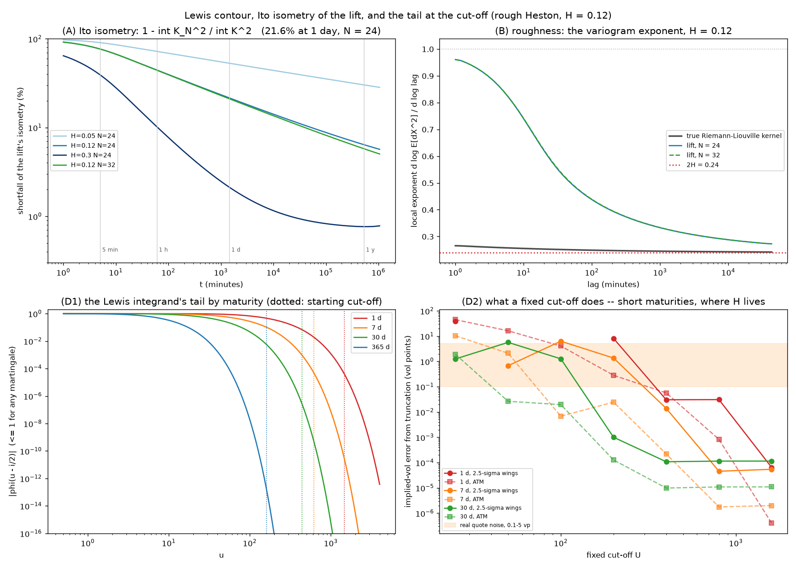
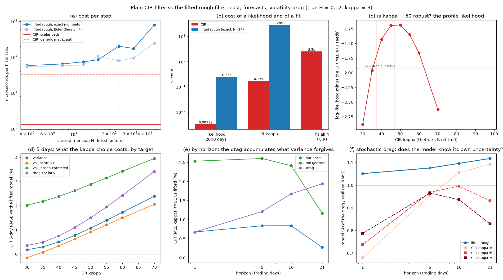
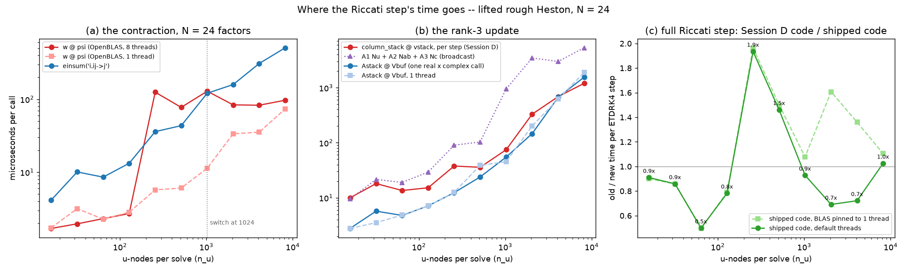
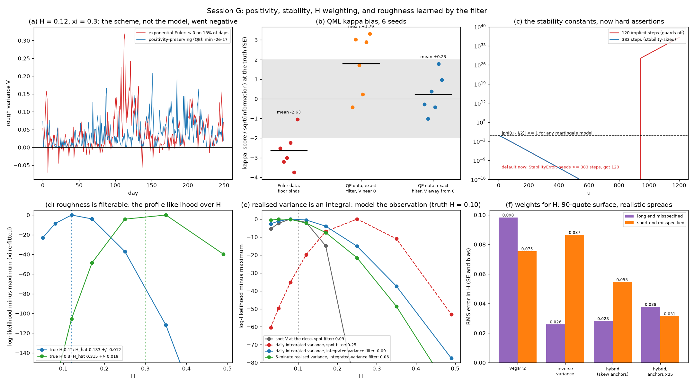

# Status

Your review of the Sessions D–F report has been worked through, every question you asked
has a measured answer, and today's four session items are done except the one that needs
your hands: recording real IBKR data needs your login. Everything downstream of that
login — recorder, pipeline, calibration, filters — is built and has been run end to end
on a synthetic recording with a known answer.

| | Sessions D–F (13 Sep) | now |
|---|---|---|
| Sessions complete | 6 of 6 | **7** (G added) |
| Test suites | 10 | **11**, all under pytest |
| Test items / checks | — / 487 | **83 / 563** |
| Analytical health checks | 90 / 90 | **107 / 107** |
| Production lines | 6,475 | 9,123 |
| Test lines | 3,634 | 4,293 |
| Commits | 26 | 30 |
| Remote | none | **private GitHub backup** (bredy00) |

Several results in this report correct earlier statements, including two claims in
the Session E report and one premise in your review. They are collected under
*Corrections*.

# Your review

**The wins you listed** stand as measured: the ξ → 0 identity (2e-16), the Fornberg
stencil (5.3e-12 on Breeden–Litzenberger) and the κ prior (spread 34.7% → 0.07%). Your
remark about estimators built for fractional Brownian motion is picked up below: the
roughness estimators are tested on exact fBm, and the time-series H estimator built
today is checked against a planted truth the same way.

## Positivity preservation (flag 3)

**Built as your adapted QE scheme, on exact moments.** In the lifted model the drift
matrix A = diag(x) + κ 1wᵀ is similar to a symmetric matrix. In its eigen-coordinates
every factor is a scalar OU process driven by the same √V dB, so the conditional mean
and covariance over a step are closed-form. The covariance is the Itô isometry evaluated
exactly; it matches brute-force quadrature to 3.5e-12. Each step then does four things:

1. Draws V from Andersen's QE law with those two moments. V is never negative, and both
   moments are exact.
2. Assigns V's surprise to the factors along the conditional regression direction.
3. Adds noise orthogonal to V, so V = v₀ + cᵀy holds exactly.
4. Draws that orthogonal noise jointly with the return's Brownian increment.

The joint draw in step 4 mattered. My first version drew it independently, and that
lost the leverage carried into future variance by the slow factors: a +2.0e-3 error on
a k = +0.08 call.

| check | result |
|---|---|
| simulated rough variance, 3000 days (ξ = 0.3) | min −2e-17 (QE) vs below zero on 13% of days (Euler) |
| one step from V₀ = 2θ, 200,000 paths | mean within 0.03 SE, variance −0.27% |
| 252 steps from far out of equilibrium | mean within 0.5 SE, variance within 1% |
| prices at 250 steps, ξ = 0.5, three strikes | worst bias 2.7e-4 vs Euler's 1.2e-3; martingale |

The Kalman filter's rough model now uses the same exact moments instead of the Euler
transition. The QML κ bias, measured as one Newton step from the truth over 6 seeds, in SE:

| data and filter | mean z |
|---|---|
| Euler data, Euler filter (Session F: the floor binds) | **−2.63** |
| QE data, exact filter, variance away from zero | **+0.23** — unbiased |
| QE data, exact filter, variance at zero on ~13% of days | +1.79 (and −0.65 with smaller noise; spread ~2) |

**The floor's bias is gone. That does not remove every bias.** Away from zero, the
estimator is unbiased. Where simulated variance sits at zero on 13% of days, a Gaussian
quasi-likelihood is unreliable in both directions, and no discretisation fixes that; it
needs a non-Gaussian filter. This is recorded as a new, narrower flag.

## The weighting scheme for H

**One correction to the premise first.** corr(H, ξ) = 0.9776 was measured with *equal*
weights. Under vega² weights it is 0.99, and across every scheme and design studied it is
0.92–0.99. The correlation belongs to the surface design, and no reweighting removes it.
What vega² weights destroy is the *standard error*: on the 20-quote surface they leave
2.3 effective quotes.

Both of your proposals are built (`calibrate/weights.py`):

- **Inverse variance:** each quote's own spread over its vega, plus a 0.1 vol-point
  model-error floor.
- **Hybrid:** inverse variance balanced so every expiry carries equal weight, plus one
  residual per expiry ≤ 30 days on the ATM skew. Each such residual is the local skew
  estimator applied to model and market vols alike, so the estimator's own bias cancels.

`study_h_weighting.py` measures each scheme at the truth by Gauss–Newton, then gives the
market a surface the model gets wrong: once at the long end (a six-month hump plus extra
long-dated curvature), once at the short end (1–3 day wings 2 vp rich).

RMS error in H, 90-quote recorder-like surface, realistic spreads:

| scheme | SE(H) | long end wrong | short end wrong | worst case |
|---|---|---|---|---|
| vega² | 0.075 | 0.098 | 0.075 | 0.098 |
| inverse variance | **0.0076** | **0.026** | 0.087 | 0.087 |
| hybrid (skew anchors) | 0.012 | 0.028 | 0.055 | 0.055 |
| hybrid, anchors × 25 | 0.031 | 0.038 | **0.032** | **0.038** |

Inverse variance cuts SE(H) tenfold. When the long end is wrong it is the best scheme.
When the short-dated wings are wrong it is the worst, because it trusts precise quotes
there. The skew anchors fit the ATM *slope*, which a symmetric wing premium does not
move, so the hybrid has the best worst case. The real-data pipeline uses the hybrid by
default. Real surfaces are wrong somewhere, and we will not know in advance where.

## Time-stepper constraints

**The measured stability constants are now hard assertions at three levels.**

1. **Precondition.** `log_char_func` refuses a mesh whose largest step exceeds the stable
   step for its |u| range, before any work, with `StabilityError: … needs ≥ 383 steps,
   got 120`. That is the 1.21e36 runaway case.
2. **Postcondition.** `char_func` refuses |φ| > 1 on −1 ≤ Im u ≤ 0.
3. **After a fit.** `calibrate_rough_heston` re-prices every expiry from scratch at the
   fitted parameters and reports `ok = False` if any strip fails.

Only convergence studies that probe beyond the edge on purpose switch the guards off, by
name. Inside calibration the Lewis pricer sizes its step count from the same constants, so
the precondition cannot trip there by construction. If it ever did, that would be a bug,
and it would stop the run rather than return a price. A parameter region that is merely
hard (a fatter tail, a failed step-halving check) still goes through the existing
refinement and failure penalty, and the optimiser steps back.

## Target metrics over n runs

Trend rules now carry your three targets. The health-check history records the host, so
timing is compared only against the same machine; a CI runner is not this laptop.

| target | rule | current |
|---|---|---|
| rough objective evaluation | rolling mean over the last 10 runs ≤ 0.75 s, same host | 0.61–0.67 s idle; best of 3 per run |
| recursive MLE vs offline MLE | per run < 1 SE; max over the last 20 runs < 2 SE | 0.23 SE |
| kernel error, N = 24 | < 0.01 on [1 day, 2 y] and [1 hour, 2 y] | 0.008697 |

Two findings behind these rows:

- **Timing noise.** On this laptop the same code timed 0.61–0.67 s idle, 0.85 s with a
  background job and 1.05 s when thermally throttled. A single timing is not a trend
  input, so each run now records the best of three.
- **The kernel target only holds for H ≥ 0.08.** N = 24 meets it at 0.97% there, but
  reaches 1.05% at H = 0.05 and 1.13% at H = 0.02, and calibration may go as low as 0.02.
  Calibration now checks the kernel error at the *fitted* H and polishes again with
  N = 32, which stays below 0.67% on the whole box.

# Your questions, measured

## What |φ| ≤ 1 means, and whether a violation is a calibration error

φ(u) = E[e^{iuX}] with X = log(S_T/F). On the Lewis contour u = v − i/2:

  |φ(v − i/2)| ≤ E[(S_T/F)^{1/2}] ≤ (E[S_T/F])^{1/2} = 1

by Jensen's inequality and the martingale property. The same argument gives |φ(u)| ≤ 1
on the whole strip −1 ≤ Im u ≤ 0. It holds for **every parameter set of every martingale
model**: it is a property of a probability law.

So a computed |φ| > 1 is never a model value, and in that sense never a calibration
error. It is always a broken solve. **But calibration is how a solve breaks.** The stable
step depends on H, ξ, ρ, κ and on the u-range. Short maturities need a wide u-range, and
an optimiser walking toward small H or large ξ crosses the edge of a step count that was
fine at the start. That is why the constants are enforced *before* the solve.

The invariant also has a limit on real data. A wrong forward leaves the model's cf
perfectly valid and shows up as skew and level misfit (ρ and H bias) instead. That is why
the pipeline checks put-call parity and the τ convention separately.

## Does the checked Lewis contour solve the fBm model? Is it Itô-isometric?



**fBm.** No, and it does not need to. Rough Heston's variance is driven by a
Riemann–Liouville kernel against a Brownian motion, not by fractional Brownian motion.
The characteristic function comes from the lifted Riccati system, and Lewis integrates it.
fBm (Davies–Harte) appears only in the fixtures that test the roughness estimators.

**Itô isometry — a finding.** The lift is exactly isometric for its own kernel. Measured
against the true kernel's isometry ∫₀ᵗ K² = t^{2H} / (2H Γ(H+½)²), the lift's variance of
the Volterra driver falls short:

| t | 1 hour | 1 day | 1 month | 1 year |
|---|---|---|---|---|
| H = 0.05, N = 24 | 72% | **53%** | 38% | 30% |
| H = 0.12, N = 24 (shipped default) | 44% | **21.6%** | 10% | 6.4% |
| H = 0.12, N = 32 | 44% | 21.1% | 9.8% | 5.8% |
| H = 0.30, N = 24 | 10% | 2.1% | 0.9% | 0.8% |

The sup-norm kernel error on the same band is 0.87%, and it cannot see this. K² ∝
s^{2H−1} (s^{−0.76} at H = 0.12) puts 28% of the one-day isometry below seven minutes,
where the lift's kernel is bounded, and 93% of the gap sits there. The rougher the kernel,
the worse it gets. Raising N does not help (N = 40: 20.9%). Only a faster top node does,
and that raises the sup-norm error unless N rises with it.

**Does it move prices?** To answer that I wrote the true rough Heston characteristic
function with no lift: the fractional Adams scheme (Diethelm–Ford–Freed), used as
El Euch & Rosenbaum do. It converges at second order to closed-form Heston at H = ½, and
its own error here is ≤ 2.5e-5 vol points. Against it:

| maturity | 1 d | 7 d | 30 d | 90 d |
|---|---|---|---|---|
| H = 0.12, lift N = 24 (shipped): worst IV error | 0.15 vp | 0.06 vp | 0.04 vp | 0.03 vp |
| ATM skew error | −1.6% | −0.7% | −0.4% | −0.3% |
| H = 0.12, lift N = 40, top node 1e8 | 0.03 vp | 0.03 vp | 0.03 vp | 0.02 vp |
| H = 0.05, lift N = 24: worst IV error | 0.19 vp | 0.08 vp | 0.05 vp | — |
| ATM skew error | −1.5% | −0.7% | −0.5% | — |
| H = 0.05, lift N = 40, top node 1e8 | 0.04 vp | 0.03 vp | 0.03 vp | — |

Prices integrate the kernel once more and largely wash the gap out, even at H = 0.05
where the isometry is 53% short at one day. The gap still matters when H is estimated from
*intraday* variance lags, where the lift is effectively smoother: its variogram exponent
over one hour to one month is 0.34 against 2H = 0.24.

**The drag is inside the cf.** E[X_T] = −i φ′(0) equals −½ E[∫V dt] from the closed-form
affine mean to 2.5e-8 (1 day), 5.9e-7 (30 days) and 3e-8 (1 year); φ(−i) = 1 exactly.

## Does it need to read the tail at the cut-off?

**Yes.** The |φ| ≤ 1 bound gives a model-free truncation bound e^{k/2} / (πU). It is
useless: U ≈ 3·10⁵ for 1e-6 in price. Here is what a fixed cut-off does to 2.5-sigma
wings:

| fixed U | 25 | 100 | 200 | 400 | checked |
|---|---|---|---|---|---|
| 1 day | 39 vp | fails | 8.2 vp | 0.03 vp | U = 2410: ~1e-4 vp |
| 7 days | fails | 6.3 vp | 1.4 vp | 0.01 vp | U = 1113: ~5e-5 vp |
| 30 days | 1.3 vp | 1.3 vp | 0.001 vp | 1e-4 vp | U = 531 |

("fails" means the truncated price left the no-arbitrage band and no implied vol exists.)
The errors are largest exactly where H is identified.

## What this does to analytics on real market data

Measured or fixed today, in order of damage avoided:

1. **The clock.** τ was computed on a naive local clock against a UTC close that ignored
   daylight saving: about 2 hours short on this UTC+3 machine, 7% at one day. That biases
   the short-end term structure, hence H. Fixed and pinned.
2. **Vega units.** IBKR quotes vega per vol point; the code assumed per unit vol. Every
   IV error came out 100× too big, and the usability filter would have discarded almost
   the whole chain, wings first. Fixed; `record_chains.py --check` verifies the units on
   the first live quote.
3. **The tail at the cut-off,** above: 1–39 vol points at one to seven days if unchecked.
4. **The lift's fidelity:** 0.15–0.19 vp at one day, at H = 0.12 and 0.05. That is below
   real short-end quote noise (0.2–5 vp), so it is acceptable for calibration.
5. **The skew-slope estimate of H is biased by vol-of-vol.** A rough Heston surface with
   H = 0.10 and ξ = 0.4 gives a skew-slope "H" of −0.03, as Session E found at ξ = 0.5.
   Never read H off the skew slope alone.
6. **Realised variance is an integral** (see Session G below). Treated as spot variance,
   it biases the filter's H from 0.10 to 0.39.
7. **Still open:** SPY options are American (the pipeline uses OTM quotes only, and the
   early-exercise premium there is small); calendar-time τ for 1–3 day options spans
   nights and weekends; IBKR's 30-day IV carries the variance risk premium, so it is not
   physical variance.

## A plain CIR filter vs the filter built for the rough model



**Cost.** A CIR filter step costs 1.2–1.3 µs. A step of the 24-factor rough filter with
exact moments costs 120–200 µs; it varies run to run on this laptop, and 79 µs with Session
F's Euler transition. A likelihood over 2,000 days takes 2.4–3.3 ms against 239–248 ms, and
fitting κ takes 0.17 s against 19–29 s: about a hundred times the cost, for a state space
that is right.

**κ ≈ 50 is not robust.** On positivity-preserving data the CIR MLE of κ is 37, 47 and 98
on three seeds. The profile likelihood is nearly flat: within 1.92 log-likelihood units
of the maximum from about 36 to 62, on average across seeds. κ is weakly identified.

**Volatility drag.** Over the sweep κ ∈ {30, …, 70}, CIR's error relative to the lifted
model's:

| horizon | variance | vol, √E[V] | vol, Jensen-corrected | drag ½∫V dt |
|---|---|---|---|---|
| 1 day | +0.3 … +1.3% | −0.0 … +1.6% | +2.3 … +3.2% | +0.3 … +1.3% |
| 5 days | +0.2 … +2.4% | −0.2 … +2.1% | +2.0 … +4.0% | +0.4 … +3.4% |
| 21 days | −0.0 … +0.6% | −1.5 … −0.7% | +1.3 … +1.6% | −0.3 … +4.7% |

So the "3% at 5 days" survives the drag in the *mean*: expected drag is forecast almost
as well. Low κ (30–40) is better than the MLE κ, and drag error grows with κ and horizon.
Two places the imitation fails:

- **Volatility.** Once the Jensen correction uses each model's own variance of V, CIR is
  2–4% worse at every horizon. Its point forecast is right; its *variance of variance* is not.
- **The stochastic drag.** At one day, CIR's forecast standard deviation of the drag is
  0.68–0.79 of the realised one, and its 90% interval covers 85–89%. The lift: 1.05 and 93%.

For risk (VaR of a return, whose drag term is random) CIR is overconfident at short
horizons at every κ tried.

## The computational efficiency of the Session E change



Measured on an idle machine, against the Session D loop exactly as committed (104f74d):

- **The contraction (w ∘ E) @ ψ, N = 24.** OpenBLAS with 8 threads pays 80–130 µs per call
  once n_u ≥ 256 (thread dispatch). einsum is 2–5× slower than single-threaded matmul at
  small n_u. **Single-threaded matmul is fastest at every size**: 1.7 µs at n_u = 16,
  11 µs at 1,024, 74 µs at 8,192.
- **The rank-3 update.** The pre-stacked product is 2–4× faster than Session D's
  per-step `column_stack @ vstack` up to n_u = 2,048.
- **The full ETDRK4 step:** 1.5–1.9× faster at n_u = 256–512, and 0.5–1.0× elsewhere
  (timings on this laptop carry ±30% noise between runs).

The report's "6–13× per step" and "1.3 ms per step starting threads" do not reproduce
here. They may have been measured under CPU contention, which inflates thread dispatch;
I cannot verify that after the fact. Calibration now pins BLAS to one thread, which
removes the dispatch entirely. End to end, the gain on a 10-expiry objective is within
timing noise on this laptop; the reason to keep it is robustness under load.

# Session G



## Real data

**The recorder.**

- **`record_chains.py`** records self-consistent cycles through the replay source:
  1. a seed pass at both rights near the money gives this cycle's put-call-parity forwards;
  2. the OTM grid is laid on a sigma band around those forwards;
  3. one sweep fills it.
  - **Cycle isolation:** request ids move on every cycle, so a late tick can never land
    on another contract. The control test shows it would.
  - **Expiries** are chosen by target maturity (1 day to 1 year); on SPY's dailies the
    old "first n" rule stopped inside a month.
  - **`--check`** is a 15-second smoke test that verifies vega units on a live quote.
- **`record_history.py`** pulls five years of daily OHLC, IBKR's 30-day implied and
  historical vol, and twelve months of 5-minute bars, a week per request, inside IBKR's
  pacing limit.

Both are tested offline against `fake_ib.py`, a TWS stand-in that delivers callbacks on a
reader thread with IBKR's tick types and units. Building it exposed four bugs that no
stand-in feed could have shown: the clock, vega units, delayed greeks on tick 83, and a
live-to-delayed fallback that never re-sent the spot request (latent since v2).

**The pipeline**, `run_real_data.py`:

- **Recorded chain:** unit and convention checks, a hybrid-weighted surface with IVs
  from the mid under our τ and forward, then Heston and rough Heston fits with their
  post-fit checks.
- **Recorded history:** realised variance, CIR and rough filters with H learned.
- **Output:** four independent readings of H side by side — skew slope, surface
  calibration, filter profile likelihood, structure function.

`--synthetic` runs the identical pipeline on a fake-exchange recording priced by rough
Heston, and on a 5-minute simulated history with H = 0.10. It recovers H = 0.085 ± 0.025
from the history.

**Not done: the recording itself.** No TWS or IB Gateway is installed on this machine,
and logging in needs your credentials and your phone. See *What needs you*.

## Model fidelity

This is the positivity scheme above, now the default in the filter, the simulator and the
real-data pipeline. Session F's rough results were measured under Euler, so their tests
are pinned to Euler and labelled, and they reproduce exactly (CIR κ 48, 54, 43; −0.6%,
+2.8%, +1.8%).

## Roughness, learned by the filter

- **The profile likelihood over H,** with ξ (and optionally κ) re-fitted at every H.
  - True H = 0.12: **0.133 ± 0.012**. H = 0.49 is rejected by 266 log-likelihood units,
    although ξ was free to climb to 1.70.
  - True H = 0.30: 0.308 ± 0.015.
  - With κ free as well, identification weakens but holds: 0.133 ± 0.019 and
    0.303 ± 0.020. κ trades against H, since fast mean reversion mimics roughness.
- **A bank of filters over an H grid,** giving an online posterior for H (0.121 ± 0.007
  on the same data). A forgetting factor lets the posterior move if roughness changes.
- **A recursive MLE with H as a filter parameter** (`LiftedRoughModelH`).
  - For any H the lift keeps the same partition of the rate axis, so the state keeps its
    meaning while H moves.
  - The observation vector w(H) moves with H, and the sensitivity equations now carry dH
    terms.
  - From H = 0.30 it reaches 0.120 within 100 days and ends at 0.119; the offline MLE is 0.115.

**Realised variance is an integral.** Daily realised variance is not a noisy reading of
spot variance. It measures the variance integrated over the day, and integration smooths a
rough path. On 500 days of synthetic rough variance with H = 0.10:

| observation fed to the filter | H recovered |
|---|---|
| spot variance at the close + noise, spot filter | 0.087 ± 0.017 |
| true daily integrated variance, spot filter | **0.25** |
| realised variance from 5-minute bars, spot filter | **0.39** |
| true daily integrated variance, integrated-variance filter | 0.092 ± 0.027 |
| realised variance, integrated-variance filter | 0.061 ± 0.027 |

`LiftedRoughRVModel` augments the state with the day's integrated variance. Its joint
conditional moments with the factors are affine in the state, computed by graded
Gauss–Legendre quadrature and checked against the closed-form factor covariance to
6.6e-16 and against Monte Carlo to within 0.6%. Realised variance's own sampling noise,
2/M · RV², enters as a state-dependent observation variance. The real-data pipeline uses
this model; fed real realised variance, the spot model would have reported H ≈ 0.4.

## Engineering

- **All eleven suites run under pytest.** A root `conftest.py` makes every `test_*`
  function a test item that fails if any of its checks failed, with the failing check
  names as the message. Nothing was rewritten, so running a suite as a script and under
  pytest cannot disagree.
- **Two tiers:** `pytest -m "not slow"` (~3 minutes) and `pytest` (everything, 11 minutes).
- **GitHub Actions** runs the quick tier on every push and the full tier plus health
  checks weekly and on demand. The health-check history is carried across CI runs in the
  Actions cache, so the n-run trend rules work in CI too.
- **The backup** is a private GitHub repository under bredy00, named `hurst` — the
  quantity everything here converges on. The IBKR recordings it will hold are licensed
  market data, so it is private until you decide otherwise.

# Corrections

1. **corr(H, ξ) = 0.9776 was the equal-weight value, not vega².** vega² gives 0.99, and all
   schemes 0.92–0.99. vega² destroys SE(H), not the correlation.
2. **Session E: "6–13× faster per ODE step"** and **"1.3 ms per step starting threads"**
   do not reproduce on an idle machine: 1.5–1.9× at n_u = 256–512, 0.5–1.0× elsewhere;
   dispatch is 80–130 µs per call.
3. **Mid-session today I measured BLAS pinning at 0.717 → 0.641 s per objective.** It did
   not reproduce within timing noise; the pinning is kept for robustness, not speed.
4. **"A positivity-preserving scheme removes the QML bias"** holds away from zero only.
   Near zero the Gaussian quasi-likelihood is unreliable.
5. **Session F: "a CIR fitted to rough variance pushes κ to ~50".** On positivity-preserving
   data, κ ranges 37–98 over seeds with a flat profile; the number is not robust.
6. **"Kernel error 0.87%" reads as "the lift reproduces the kernel".** The variance of the
   Volterra driver is 21.6% short at one day. Prices are still within 0.15 vp of true
   rough Heston.
7. **The health check's single timing of the rough objective** ranged 0.61–1.05 s on
   unchanged code; it is now the best of three.
8. **Session F's rough-host filter results** were measured under the Euler scheme; those
   tests are now pinned to Euler and labelled as such.
9. **The live-to-delayed data fallback never re-sent the spot request**, carried unnoticed
   from v2.

# Open flags

1. **Real data is not recorded.** It needs the IB Gateway login (tutorial below).
2. **Near-zero variance:** the Gaussian QML is unreliable when variance sits at zero; a
   particle filter or a characteristic-function likelihood is the fix.
3. **Realised variance's noise** is modelled for a diffusion. Microstructure noise and jumps
   inflate 5-minute RV; bipower variation is the robust alternative.
4. **Calendar-time τ for 1–3 day options** spans nights and weekends, which distorts the
   short end, where H lives.
5. **The lift's short-lag isometry gap** matters for intraday estimation of H. The finer
   lift (N = 40, top node 1e8) fixes it for about 1.7× the cf cost and 2.5× the filter cost.
6. **The skew-slope H estimator is biased by vol-of-vol;** use it as a cross-check only.
7. **IBKR's 30-day IV carries the variance risk premium,** so it is not usable as a
   physical variance observation without modelling that premium.
8. **Rough host jump mode** (driver vs direct), carried from Session F: your decision.
9. **Hawkes on real events,** and the nearly-unstable Hawkes → rough volatility link.
10. **`volatility_surface_3.py` should be split.**

# What needs you

**1. Record the data.** `docs/tutorial-ibkr-recording.md` walks through it step by step.
In short: install IB Gateway, log in with API settings (read-only), then

- `record_chains.py --check` (15 seconds)
- `record_history.py` (any time, ~10 minutes)
- `record_chains.py --every 15 --until 15:45` during US market hours: 16:30–23:00
  Istanbul until 31 October

Then tell me "recorded", and `run_real_data.py` does the rest.

**2. Four decisions.**

1. Rough jump mode (carried from Session F).
2. Particle filter or cf-based likelihood for near-zero variance.
3. Whether to adopt the finer lift for intraday H work.
4. Whether the GitHub backup should stay private (recommended while it holds recorded
   market data).

# Next

1. The first real-data run: the four readings of H on SPY, and the Heston vs rough Heston
   fit on a real surface.
2. A non-Gaussian filter for the zero boundary.
3. A trading-time clock for short-dated options, measured on the real chains.

# Appendix: health and sanity checks

**Foundations**

| check | measured | threshold | verdict |
|---|---|---|---|
| norm_pdf vs scipy | `0` | `1.00e-15` | PASS |
| norm_cdf vs scipy | `2.22e-16` | `1.00e-15` | PASS |
| put-call parity C-P = F-K | `2.84e-14` | `1.00e-09` | PASS |
| vega vs central difference | `4.23e-09` | `1.00e-04` | PASS |
| implied-vol round trip | `8.05e-16` | `1.00e-06` | PASS |
| fd_first exact on a quadratic | `7.46e-14` | `1.00e-12` | PASS |
| fd_second on a quadratic vs its rounding floor<br><sub>2.08e-11 measured, floor 5.06e-11</sub> | `0.41 x floor` | `1 x floor` | PASS |
| shipped 2nd derivative: order on a $1/$5 kink grid<br><sub>Fornberg 5-point; mapped-coordinate idea measured at 0.01</sub> | `3.077` | `2` | PASS |
| 3-point stencil order on the same grid (kept for contrast)<br><sub>the documented first-order loss</sub> | `1.086` | `1.5` | PASS |

**Heston cf**

| check | measured | threshold | verdict |
|---|---|---|---|
| phi(0) = 1 | `0` | `1.00e-12` | PASS |
| phi(-i) = 1 (martingale) | `0` | `1.00e-10` | PASS |
| phi(-u) = conj(phi(u)) | `0` | `1.00e-12` | PASS |
| \|phi(u)\| <= 1 | `0.9999` | `1` | PASS |
| branch continuity, shipped (max/median step)<br><sub>Albrecher g=(a-d)/(a+d)</sub> | `5.242` | `50` | PASS |
| branch discontinuity, reciprocal form<br><sub>the trap, kept to prove it is real</sub> | `2825` | `500` | PASS |
| trap / shipped separation | `538.9 x` | `100 x` | PASS |
| xi -> 0 degenerates to Black-Scholes<br><sub>at xi=1e-8, cancellation-free form; was 5.9e-09 at xi=1e-4</sub> | `2.22e-16` | `1.00e-14` | PASS |
| naive-form cancellation at xi=1e-6 (kept to prove it)<br><sub>shipped form is 5.7e-13 at the same xi</sub> | `3.44e-05` | `1.00e-06` | PASS |

**Pricers**

| check | measured | threshold | verdict |
|---|---|---|---|
| Lewis vs exact Black-76 | `3.55e-15` | `1.00e-10` | PASS |
| Carr-Madan vs exact Black-76 | `1.94e-16` | `1.00e-10` | PASS |
| Lewis vs Carr-Madan on Heston<br><sub>independent routes, 5 maturities</sub> | `4.99e-15` | `1.00e-08` | PASS |
| Carr-Madan insensitive to damping alpha<br><sub>alpha 0.75 to 3.0</sub> | `6.11e-16` | `1.00e-08` | PASS |
| Fourier vs Monte Carlo (sigmas)<br><sub>residual is Euler O(dt) bias</sub> | `0.3618 sd` | `5 sd` | PASS |
| simulated E[S/F] = 1 | `1.94e-06` | `6.12e-04` | PASS |
| risk-neutral density mass | `1` | `1` | PASS |
| risk-neutral density mean = forward | `1` | `1` | PASS |
| density non-negativity (min/peak)<br><sub>tail dither scales as 1/dK^2</sub> | `-8.87e-10` | `-1.00e-07` | PASS |
| sampling density: min >= eps and mass = 1<br><sub>floored 622 pts, removed -5.1e-10 of mass</sub> | `0` | `1.00e-12` | PASS |

**Estimators**

| check | measured | threshold | verdict |
|---|---|---|---|
| H from ATM skew (planted 0.12)<br><sub>r2 = 1.00000</sub> | `0.12` | `0.12` | PASS |
| H from structure function, worst of 4 planted<br><sub>H = 0.10, 0.12, 0.30, 0.50</sub> | `0.0062` | `0.03` | PASS |
| two independent H routes agree<br><sub>surface route vs path route</sub> | `0.002891` | `0.05` | PASS |
| forward from put-call parity<br><sub>r2 = 1.000000, no rate or dividend input</sub> | `1.14e-13` | `1.00e-06` | PASS |
| discount factor from parity | `4.44e-16` | `1.00e-09` | PASS |
| SVI parameter recovery | `1.43e-08` | `0.001` | PASS |
| SVI slice passes Durrleman<br><sub>g_min over data = 0.2297</sub> | `1` | `1` | PASS |
| butterfly audit: false positives on a convex slice | `0` | `0` | PASS |
| butterfly audit: catches a planted dent<br><sub>flags the dent's neighbours</sub> | `2` | `1` | PASS |
| calendar audit: clean on monotone w | `0` | `0` | PASS |
| calendar audit: catches a reversal | `3` | `1` | PASS |

**Calibration**

| check | measured | threshold | verdict |
|---|---|---|---|
| plant-and-recover, worst relative error<br><sub>7 iters, 0.6s</sub> | `3.13e-11 rel` | `0.01 rel` | PASS |
| fitted RMSE on clean data | `4.06e-09 vol pts` | `0.001 vol pts` | PASS |
| Jacobian condition number at the solution<br><sub>high = parameters trade off; see identifiability</sub> | `30.05` | `1.00e+08` | PASS |
| spread of v0 under 0.5vp noise<br><sub>stable</sub> | `3.775 %` | `10 %` | PASS |
| spread of kappa under 0.5vp noise<br><sub>unidentified</sub> | `34.73 %` | `50 %` | PASS |
| spread of theta under 0.5vp noise<br><sub>stable</sub> | `2.803 %` | `50 %` | PASS |
| spread of xi under 0.5vp noise<br><sub>loose</sub> | `19.13 %` | `50 %` | PASS |
| spread of rho under 0.5vp noise<br><sub>stable</sub> | `3.73 %` | `10 %` | PASS |
| spread of kappa with a Tikhonov prior (weight 50)<br><sub>prior from a history or a variance swap</sub> | `0.07281 %` | `10 %` | PASS |

**Markovian lift**

| check | measured | threshold | verdict |
|---|---|---|---|
| K(t) = int e^-xt mu(dx) representation<br><sub>mu(dx) = x^-a / (Gamma(a)Gamma(1-a)) dx, a = H+1/2</sub> | `6.67e-10 rel` | `1.00e-08 rel` | PASS |
| kernel error, N=24, t in [1 day, 2 y]<br><sub>max relative; H = 0.12</sub> | `0.008697 rel` | `0.01 rel` | PASS |
| kernel error on [1 hour, 2 y]<br><sub>a one-day option lives here; 12% below 5 minutes</sub> | `0.008697 rel` | `0.01 rel` | PASS |
| kernel error, N=24, worst over H in [0.08, 0.5]<br><sub>H = 0.05: 0.0105, H = 0.02: 0.0113 -- above 1%</sub> | `0.00972 rel` | `0.01 rel` | PASS |
| kernel error, N=32, worst over the whole H box [0.02, 0.5]<br><sub>what calibration refits with when a fit lands below H = 0.08</sub> | `0.006656 rel` | `0.01 rel` | PASS |
| Laplace-domain error, z in [0.1, 100] (plan: 1%, see note)<br><sub>3.5% is the memory beyond 2 y; 1% is not reachable with a 2 y fit</sub> | `0.03508 rel` | `0.05 rel` | PASS |
| Laplace-domain error on the pricing band z in [1, 100]<br><sub>a year down to a few days</sub> | `0.01419 rel` | `0.03 rel` | PASS |
| lifted recursion == SOE convolution (identity) | `4.05e-14` | `1.00e-12` | PASS |
| lifted path vs true-kernel Volterra path (L2, same noise) | `0.008001 rel` | `0.01 rel` | PASS |
| N=1 at x=0 reproduces closed-form Heston (ETDRK4, 200 steps) | `7.09e-10` | `1.00e-09` | PASS |
| full N-node lift at H = 0.4999 vs Heston<br><sub>shrinks 10x per decade of (1/2 - H)</sub> | `1.64e-05` | `1.00e-04` | PASS |
| ETDRK4 vs implicit trapezoidal + Richardson (H=0.12)<br><sub>independent time-steppers, 1 d / 30 d / 1 y</sub> | `3.79e-06` | `5.00e-06` | PASS |
| rough objective evaluation, 10 expiries x 13 strikes<br><sub>best of 3 (all: 0.97, 0.62, 0.60); trend target: rolling mean <= 0.75 s</sub> | `0.6048 s` | `3 s` | PASS |

**Rough robustness**

| check | measured | threshold | verdict |
|---|---|---|---|
| exptrap at 120 steps, u to 1200, guards off (NOT unconditionally stable)<br><sub>\|phi(u - i/2)\| must be <= 1; kept to prove the constraint</sub> | `1.21e+36` | `1` | PASS |
| stability constants enforced: the same solve raises StabilityError<br><sub>hard precondition since Session G; \|phi\| <= 1 is a hard postcondition</sub> | `1` | `1` | PASS |
| stability-sized exptrap, same u range: max \|phi(u - i/2)\|<br><sub>383 steps</sub> | `0.9988` | `1` | PASS |
| runaway parameters: maturities priced in-band (of 4)<br><sub>Carr-Madan returned 1.9e18 / 2.9e28 at 30 / 90 d here</sub> | `4` | `4` | PASS |
| unpriceable quote: minimum charge (vol) vs 0 before<br><sub>exact fit costs 1.4e-22</sub> | `4.754` | `4.754` | PASS |

**Rough identifiability**

| check | measured | threshold | verdict |
|---|---|---|---|
| SE(H), 20 quotes, equal weights, 0.5 vp noise | `0.04711` | `0.06` | PASS |
| SE(H), same quotes, vega^2 weights<br><sub>H not identified: the weights discard the short end</sub> | `0.2024` | `0.15` | PASS |
| corr(H, xi) at the truth<br><sub>the rough analogue of kappa/theta</sub> | `0.9776` | `0.9` | PASS |

**Hawkes**

| check | measured | threshold | verdict |
|---|---|---|---|
| mean rate vs mu/(1-n), in SE<br><sub>12.457 vs 12.5</sub> | `0.5936 SE` | `3 SE` | PASS |
| count variance / Hawkes (1971) closed form, 0.25 y<br><sub>Fano 5.93</sub> | `1.019` | `0.15` | PASS |
| MLE plant-and-recover, worst \|z\| | `1.004` | `3` | PASS |
| time rescaling KS p, Hawkes fit (should pass) | `0.5838` | `0.01` | PASS |
| time rescaling KS p, Poisson fit to the same events<br><sub>clustering is detected, not assumed</sub> | `0` | `1.00e-06` | PASS |
| second spike: superposition identity, 4 hosts<br><sub>inc2 - inc1 = r(d+W) - r(d)</sub> | `8.88e-16` | `1.00e-12` | PASS |
| Heston: property switches on at alpha = kappa (1.03 kappa)<br><sub>at 0.97 kappa: -2.1e-06</sub> | `1.38e-06` | `0` | PASS |
| rough (driver jumps): pairs with the property at n = 0.6<br><sub>14 of 21 at n = 0.95 -- needs near-critical clustering</sub> | `0` | `0` | PASS |
| kurtosis vs scale-mixture closed form, in SE<br><sub>5.73 vs 5.59; ratio to Poisson = daily Fano</sub> | `0.7597 SE` | `4 SE` | PASS |

**Kalman**

| check | measured | threshold | verdict |
|---|---|---|---|
| fast scalar path vs generic matrix filter | `0` | `1.00e-12` | PASS |
| RMSE improvement minus steady-state theory<br><sub>45.6% vs 45.2%</sub> | `0.3392 pts` | `2 pts` | PASS |
| lecture AR(1) kappa on noisy quotes / true kappa<br><sub>attenuation bias; MLE through the filter is unbiased</sub> | `12.6 x` | `2 x` | PASS |
| dual vs joint EKF agreement | `0.129 %` | `1 %` | PASS |
| recursive MLE (Ljung) distance from the MLE<br><sub>Wan-Nelson dual: 0.07 SE</sub> | `0.2287 SE` | `1 SE` | PASS |
| strict: steps to re-converge after the regime change<br><sub>bad-print excursion 2.0x normal error</sub> | `18` | `2` | PASS |
| adaptive: bad-print excursion (x normal error)<br><sub>re-converges in 0 steps</sub> | `14.92 x` | `6.044 x` | PASS |
| robust: steps to re-converge (and ignores the print)<br><sub>excursion 1.7x vs strict 2.0x</sub> | `1.5` | `2` | PASS |
| lifted rough filter: RMSE improvement over quotes<br><sub>24 lifted factors as the state, rank-one Q</sub> | `39.67 %` | `30 %` | PASS |

**Recording (real data)**

| check | measured | threshold | verdict |
|---|---|---|---|
| tau: 17:00 Istanbul to next close, hours<br><sub>a naive local clock gave 27 h (fixed in Session G)</sub> | `30 h` | `30 h` | PASS |
| US close in UTC follows daylight saving | `1` | `1` | PASS |
| delayed greeks (tick 83) recorded, vega per 1.00 vol<br><sub>IBKR sends vega per vol point</sub> | `1 x` | `1 x` | PASS |

**Positivity (Session G)**

| check | measured | threshold | verdict |
|---|---|---|---|
| QE step: mean vs exact conditional mean, in SE<br><sub>variance -0.27% vs exact; min V 2.7e-11</sub> | `0.02983 SE` | `4 SE` | PASS |
| quadrature of the integrated-variance moments | `1.07e-15 rel` | `1.00e-12 rel` | PASS |
| rough variance simulated 3000 days: minimum<br><sub>Euler at the same parameters: below zero on 13% of days</sub> | `-2.08e-17` | `-1.00e-12` | PASS |
| exact-moment filter: QML kappa bias away from zero, mean z<br><sub>near zero a Gaussian quasi-likelihood is unreliable (open flag)</sub> | `0.6433 SE` | `2 SE` | PASS |

**Lift fidelity (Session G)**

| check | measured | threshold | verdict |
|---|---|---|---|
| 7-day IV, lift N=24 vs true rough Heston (fractional Adams)<br><sub>1 day: 0.15 vp, skew -1.6% (study_lewis_isometry.py)</sub> | `0.0634 vp` | `0.1 vp` | PASS |
| Ito isometry of the lift at 1 day, shortfall vs true kernel<br><sub>93% of it from lags under 7 minutes; prices integrate it away</sub> | `21.6 %` | `25 %` | PASS |

**H weighting (Session G)**

| check | measured | threshold | verdict |
|---|---|---|---|
| SE(H): inverse variance / vega^2<br><sub>0.0749 -> 0.0076</sub> | `0.1018 x` | `0.25 x` | PASS |
| worst-case RMS error in H: hybrid (anchors x25)<br><sub>inverse variance 0.087, vega^2 0.098</sub> | `0.03783` | `0.08654` | PASS |
| min \|corr(H, xi)\| over all schemes and designs<br><sub>structural: re-weighting cannot remove it</sub> | `0.9219` | `0.9` | PASS |

**Learning H (Session G)**

| check | measured | threshold | verdict |
|---|---|---|---|
| filter profile likelihood: \|H_hat - 0.12\| in SE<br><sub>H_hat 0.133 +/- 0.012, xi re-fitted at each H</sub> | `1.051 SE` | `3 SE` | PASS |
| log-likelihood of H = 0.49 against the best H<br><sub>Heston-like roughness rejected with xi free</sub> | `-266` | `-20` | PASS |

**Engineering**

| check | measured | threshold | verdict |
|---|---|---|---|
| scipy modules on the live import path<br><sub>scipy.stats alone costs 5.8 s</sub> | `0` | `0` | PASS |
| startup to actionable error, no TWS<br><sub>was 9.6 s before lazy imports</sub> | `0.5423 s` | `3 s` | PASS |
| calibration objective evaluation<br><sub>39 quotes; 470 ms before vectorising</sub> | `8.565 ms` | `200 ms` | PASS |
| Gauss-Legendre rules constructed<br><sub>2 reuses; leggauss is O(n^2)</sub> | `1` | `1` | PASS |
| quadrature tolerance 1e-12 vs 1e-14<br><sub>calibration runs at 1e-12, ~2x faster</sub> | `0` | `1.00e-12` | PASS |
| replay round-trip fidelity<br><sub>recorded vs replayed surface points</sub> | `0` | `1.00e-12` | PASS |

107 of 107 checks pass (58s).

The trend over the recorded runs (flags would appear in the last column):

```
Trend over 8 recorded run(s)
--------------------------------------------------------------------------
  check                                            n       mean        std       last  flags
  3-point stencil order on the same grid (kept f   8      1.086          0      1.086  
  7-day IV, lift N=24 vs true rough Heston (frac   2     0.0634          0     0.0634  
  Carr-Madan insensitive to damping alpha          8   6.11e-16          0   6.11e-16  
  Carr-Madan vs exact Black-76                     8   1.94e-16          0   1.94e-16  
  ETDRK4 vs implicit trapezoidal + Richardson (H   8   3.79e-06   7.88e-18   3.79e-06  
  Fourier vs Monte Carlo (sigmas)                  8     0.3618          0     0.3618  
  Gauss-Legendre rules constructed                 8          1          0          1  
  H from ATM skew (planted 0.12)                   8       0.12          0       0.12  
  H from structure function, worst of 4 planted    8     0.0062          0     0.0062  
  Heston: property switches on at alpha = kappa    5   1.38e-06          0   1.38e-06  
  Ito isometry of the lift at 1 day, shortfall v   2       21.6          0       21.6  
  Jacobian condition number at the solution        8      30.05          0      30.05  
  K(t) = int e^-xt mu(dx) representation           8   6.67e-10          0   6.67e-10  
  Laplace-domain error on the pricing band z in    7    0.01419   3.75e-18    0.01419  
  Laplace-domain error, z in [0.1, 100] (plan as   1    0.03508          0    0.03508  
  Laplace-domain error, z in [0.1, 100] (plan: 1   7    0.03508          0    0.03508  
  Lewis vs Carr-Madan on Heston                    8   4.99e-15          0   4.99e-15  
  Lewis vs exact Black-76                          8   3.55e-15          0   3.55e-15  
  MLE plant-and-recover, worst |z|                 5      1.004          0      1.004  
  N=1 at x=0 reproduces closed-form Heston (ETDR   8   7.09e-10          0   7.09e-10  
  QE step: mean vs exact conditional mean, in SE   2    0.02983          0    0.02983  
  RMSE improvement minus steady-state theory       5     0.3392          0     0.3392  
  SE(H), 20 quotes, equal weights, 0.5 vp noise    6    0.04711          0    0.04711  
  SE(H), same quotes, vega^2 weights               6     0.2024          0     0.2024  
  SE(H): inverse variance / vega^2                 2     0.1018          0     0.1018  
  SVI parameter recovery                           8   1.43e-08          0   1.43e-08  
  SVI slice passes Durrleman                       8          1          0          1  
  US close in UTC follows daylight saving          2          1          0          1  
  adaptive: bad-print excursion (x normal error)   5      14.92          0      14.92  
  branch continuity, shipped (max/median step)     8      5.242          0      5.242  
  branch discontinuity, reciprocal form            8       2825          0       2825  
  butterfly audit: catches a planted dent          8          2          0          2  
  butterfly audit: false positives on a convex s   8          0          0          0  
  calendar audit: catches a reversal               8          3          0          3  
  calendar audit: clean on monotone w              8          0          0          0  
  calibration objective evaluation                 8      9.711      2.347      8.565  
  corr(H, xi) at the truth                         6     0.9776   1.22e-16     0.9776  
  count variance / Hawkes (1971) closed form, 0.   5      1.019          0      1.019  
  delayed greeks (tick 83) recorded, vega per 1.   2          1          0          1  
  density non-negativity (min/peak)                8  -8.87e-10          0  -8.87e-10  
  discount factor from parity                      8   4.44e-16          0   4.44e-16  
  dual vs joint EKF agreement                      5      0.129          0      0.129  
  exact-moment filter: QML kappa bias away from    2     0.6433          0     0.6433  
  exptrap at 120 steps, u to 1200 (NOT unconditi   4   1.21e+36          0   1.21e+36  
  exptrap at 120 steps, u to 1200, guards off (N   2   1.21e+36          0   1.21e+36  
  fast scalar path vs generic matrix filter        5          0          0          0  
  fd_first exact on a quadratic                    8   7.46e-14          0   7.46e-14  
  fd_second on a quadratic vs its rounding floor   8       0.41          0       0.41  
  filter profile likelihood: |H_hat - 0.12| in S   2      1.051          0      1.051  
  fitted RMSE on clean data                        8   4.06e-09          0   4.06e-09  
  forward from put-call parity                     8   1.14e-13          0   1.14e-13  
  full N-node lift at H = 0.4999 vs Heston         8   1.64e-05   2.33e-17   1.64e-05  
  implied-vol round trip                           8   8.05e-16          0   8.05e-16  
  kernel error on [1 hour, 2 y]                    8   0.008697          0   0.008697  
  kernel error, N=24, t in [1 day, 2 y]            8   0.008697          0   0.008697  
  kernel error, N=24, worst over H in [0.08, 0.5   2    0.00972          0    0.00972  
  kernel error, N=32, worst over the whole H box   2   0.006656          0   0.006656  
  kurtosis vs scale-mixture closed form, in SE     5     0.7597          0     0.7597  
  lecture AR(1) kappa on noisy quotes / true kap   5       12.6          0       12.6  
  lifted path vs true-kernel Volterra path (L2,    8   0.008001          0   0.008001  
  lifted recursion == SOE convolution (identity)   8   4.05e-14          0   4.05e-14  
  lifted rough filter: RMSE improvement over quo   5      44.31      4.242      39.67  
  log-likelihood of H = 0.49 against the best H    2       -266          0       -266  
  mean rate vs mu/(1-n), in SE                     5     0.5936          0     0.5936  
  min |corr(H, xi)| over all schemes and designs   2     0.9219          0     0.9219  
  naive-form cancellation at xi=1e-6 (kept to pr   8   3.44e-05          0   3.44e-05  
  norm_cdf vs scipy                                8   2.22e-16          0   2.22e-16  
  norm_pdf vs scipy                                8          0          0          0  
  phi(-i) = 1 (martingale)                         8          0          0          0  
  phi(-u) = conj(phi(u))                           8          0          0          0  
  phi(0) = 1                                       8          0          0          0  
  plant-and-recover, worst relative error          8   3.13e-11          0   3.13e-11  
  put-call parity C-P = F-K                        8   2.84e-14          0   2.84e-14  
  quadrature of the integrated-variance moments    2   1.07e-15          0   1.07e-15  
  quadrature tolerance 1e-12 vs 1e-14              8          0          0          0  
  recursive MLE (Ljung) distance from the MLE      5     0.2287          0     0.2287  
  replay round-trip fidelity                       8          0          0          0  
  risk-neutral density mass                        8          1          0          1  
  risk-neutral density mean = forward              8          1          0          1  
  robust: steps to re-converge (and ignores the    5        1.5          0        1.5  
  rough (driver jumps): pairs with the property    5          0          0          0  
  rough objective evaluation, 10 expiries x 13 s   8     0.7122       0.16     0.6048  
  rough variance simulated 3000 days: minimum      2  -2.08e-17          0  -2.08e-17  
  runaway parameters: maturities priced in-band    6          4          0          4  
  sampling density: min >= eps and mass = 1        8          0          0          0  
  scipy modules on the live import path            8          0          0          0  
  second spike: superposition identity, 4 hosts    5   8.88e-16          0   8.88e-16  
  shipped 2nd derivative: order on a $1/$5 kink    8      3.077          0      3.077  
  simulated E[S/F] = 1                             8   1.94e-06          0   1.94e-06  
  spread of kappa under 0.5vp noise                8      34.73          0      34.73  
  spread of kappa with a Tikhonov prior (weight    8    0.07281          0    0.07281  
  spread of rho under 0.5vp noise                  8       3.73          0       3.73  
  spread of theta under 0.5vp noise                8      2.803          0      2.803  
  spread of v0 under 0.5vp noise                   8      3.775          0      3.775  
  spread of xi under 0.5vp noise                   8      19.13          0      19.13  
  stability constants enforced: the same solve r   2          1          0          1  
  stability-sized exptrap, same u range: max |ph   6     0.9988          0     0.9988  
  startup to actionable error, no TWS              8      0.602     0.1361     0.5423  
  strict: steps to re-converge after the regime    5         18          0         18  
  tau: 17:00 Istanbul to next close, hours         2         30          0         30  
  time rescaling KS p, Hawkes fit (should pass)    5     0.5838          0     0.5838  
  time rescaling KS p, Poisson fit to the same e   5          0          0          0  
  trap / shipped separation                        8      538.9          0      538.9  
  two independent H routes agree                   8   0.002891          0   0.002891  
  unpriceable quote: minimum charge (vol) vs 0 b   6      4.754          0      4.754  
  vega vs central difference                       8   4.23e-09          0   4.23e-09  
  worst-case RMS error in H: hybrid (anchors x25   2    0.03783          0    0.03783  
  xi -> 0 degenerates to Black-Scholes             8   2.22e-16          0   2.22e-16  
  |phi(u)| <= 1                                    8     0.9999          0     0.9999  
  0 flagged
```

