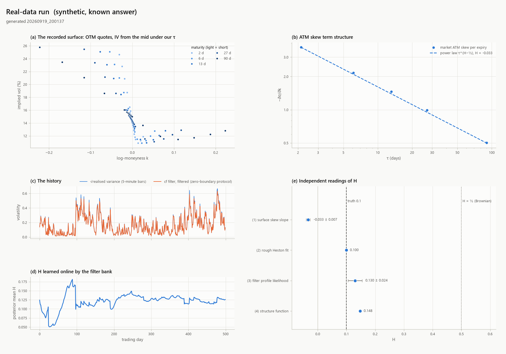
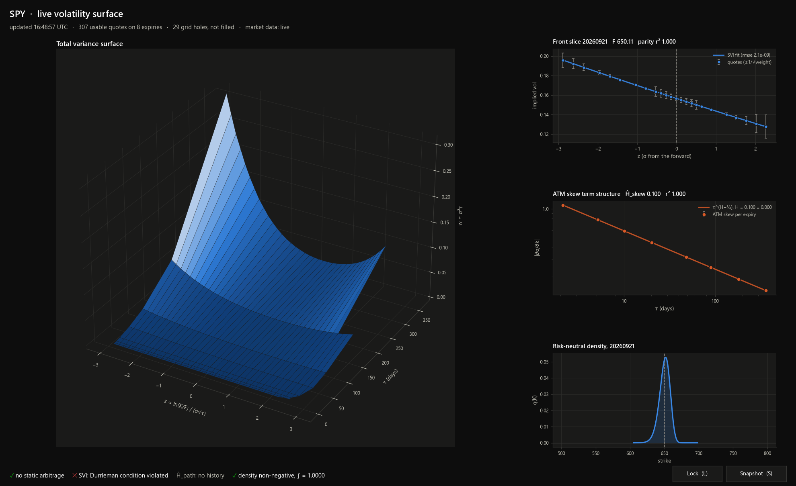

# Session I: your decisions, implemented

*18–19 September 2026. This covers the configuration you chose for real-data runs, the
health-check thresholds you set, the last sanity checks before release, the dashboard
and figure polish, and the v1.0.0 release. The fBm comparison you asked for was sent
separately (`docs/comparison-fbm-methods.pdf`).*

## Summary

| your decision | status | what it took |
|---|---|---|
| Adopt the finer lift (N = 40, top node 1e8/y) | **done, default** | Five tests broke. Four were test premises the finer lift made obsolete. The fifth was real: QE Monte Carlo was 7 SE off the cf at the money. Found and fixed in the simulator (*The finer lift*). |
| cf filter where the zero boundary binds, 16-substep particle filter only to confirm, Kalman elsewhere | **done** (`filters/protocol.py`, wired into `run_real_data.py`) | The cf filter needed a realised-variance observation. That is a second transform, a new frequency grid, and a new update. At a hard boundary the 16-substep particle filter proved the least reliable party, so the protocol escalates it (*The zero-boundary protocol*). |
| Driver jumps only, sized by integrated variance impact | **done** | Direct mode is gone from the model. It is kept in `study_jump_modes.py` so the Session H brief still reproduces. |
| Health-check thresholds | **done** | The rolling-mean timing target, the recursive-MLE and kernel-error bounds, and the ω = 1 identity were already wired. New: a throttle guard, and the 2025 clock split asserted exactly. |
| Last sanity checks | **done** | *The last checks*. |
| UI/UX polish | **done** | One design system for the dashboard and the report figure, a demo mode, and the report figure's dual axis removed (*Dashboard and figures*). |
| Release | **v1.0.0** | Tagged, with a GitHub release on the private repo. |

## The finer lift

The lift is now 40 nodes up to 1e8 per year. The previous default was 24 nodes up to 1e5.
`rh.using_lift(24, 1e5)` still runs the whole stack on the old lift, and
`run_real_data.py --lift 24:1e5` does the same for a real run.

**What it resolves.** With the lag-0 cell mean included, the old lift's error on the
sub-day singularity was 1.09%; the new one's is 0.64%, the same as its error elsewhere. The
default lift's kernel error stays below 1% over [1 day, 2 years] and [1 hour, 2 years]
for every H in [0.02, 0.5]; those are health checks with trend rules. The Riccati
stability constants were measured again on the new lift (`study_stability_constants.py`):
ETDRK4 is stable at z = 3.0 and blows up at 4.0; exptrap's edge is 14.5 to 18.8. The
constants in use, 2.0 and 12.0, sit below every edge on both lifts, so they did not
change.

**Cost.** The Riccati loops now multiply the real-interleaved view of the complex state,
so the real weights go through BLAS without a complex cast. The contractions are 9×
faster and the rank-2 update 18×, against the old code to 3.3e-16. The objective timing
is under *The last checks*.

**What adopting it broke, and why.**

| test | on the new lift | resolution |
|---|---|---|
| the sub-cell singularity is the only place the lift is worse than 1% | 0.64% vs 0.64% | the premise is obsolete: the new lift resolves it. Now two checks: < 1% on the default lift, > 1% on the old one (1.09%) |
| doubling the ETDRK4 steps moves the cf by < 1e-6 | 1.6e-6 at one day | 4.5e-5 vol points in the one-day smile. The check is now 2e-6 on the cf, plus < 1e-3 vp on implied vols at 1, 30 and 365 days (worst measured 1.8e-4) |
| E[integrated variance], closed form vs quadrature, 1e-10 | 3.2e-9 | the test's quadrature was wrong. Its breakpoints stopped at h·1e-6, but the fastest factor now decays on 1e-8 y. Graded to h·1e-12, the agreement is 4e-13 |
| QE prices match the cf within 4.5 SE (250 steps) | at the money +1.1e-3, 7.4 SE | **a real simulator bias**, below |
| QE's bias < 1/3 of Euler's | 1.1e-3 vs 1.2e-3 | same cause |

**The QE bias.** It was not leverage, since it persisted at ρ = 0. It was not
discretisation either: it did not shrink from 125 to 1000 steps. The integrated variance
came out 3.0% too high on average (4.4 SE). The mechanism has four steps:

1. The QE step splits V's surprise across the factors and adds Gaussian noise orthogonal
   to V, with a fixed size, whatever V_h turned out to be.
2. At ψ ≈ 3–4 over half the draws land on V_h = 0, yet the factors were still shaken.
3. On the 40-node lift 5.2% of steps then started from a state whose next conditional
   mean was ≤ 0; on the old lift it was 2.5%.
4. From such a state QE can only draw 0. That is a push of −m, so the mean drifts up,
   and more steps make it worse.

Turning the orthogonal noise off removed the inadmissible states entirely, which
isolated the cause.

**The fix** (`LiftedAffineStep.NOISE_SCALE = "end"`) scales that noise by r² = V_h / m.
Since E[r²] = 1, the factors' covariance is unchanged on average. The noise vanishes when
the draw lands at zero, as a stiff factor's does: its noise sits in the last instants of
the step, where the local variance is V_h. The leverage term and the martingale
correction follow the same scaling. Measured at 250 steps on the 40-node lift:

| | before | after |
|---|---|---|
| steps starting from an inadmissible state | 5.2% | 0.6% |
| E[∫V] vs exact | +3.0% (4.4 SE) | +0.9% (1.3 SE) |
| ρ = 0, at-the-money call | +9.1e-4 (4.2 SE) | +1.2e-4 (0.6 SE) |
| ρ = −0.7, at-the-money call | +1.0e-3 (7.0 SE) | +1.7e-4 (1.2 SE) |
| ρ = −0.7, k = +0.08 call | +7.1e-4 (12.3 SE) | +2.3e-4 (4.2 SE) |

A skew bias remains with leverage, and it shrinks with the steps: +3.2e-4, +1.7e-4 and
+1.5e-4 on the k = +0.08 call at 250, 500 and 1000 steps. A variant that scaled the noise
by the step's integrated variance instead was worse (3.4% inadmissible, +4.6e-4), so it
was not kept. Pricing never uses Monte Carlo (it uses the cf); the simulator feeds the
synthetic data and the particle filter.

One slip was caught while fixing this. In the martingale correction the noise term
multiplies V_h itself, not V_h − m, and the first version centred it wrongly. E[S] came
out 1.1e-3 high. It is fixed, and the test suite checks E[S] = F within 3 SE.

## The zero-boundary protocol

`filters/protocol.py`, run at the end of the history stage of `run_real_data.py`:

1. **Kalman.** The exact-moment Kalman filter for daily realised variance, at the
   pipeline's maximum-likelihood parameters.
2. **Does the boundary bind?** This is read off the Kalman filter's own one-step
   predictions: the share of days whose predicted spot variance lies within two
   predictive SDs of zero. Up to 5% the boundary does not bind, and the Kalman filter
   stays.
3. **cf filter.** Above 5%, the cf filter takes the state estimate.
4. **Confirmation.** The particle filter runs with 16 QE substeps, on two seeds, at the
   same parameters. The cf filter is confirmed if the seeds agree, the log-likelihoods
   agree within 0.05 nats a day, and the filtered RV agrees within 5% (median) on
   boundary days.
5. **Escalation.** If they disagree, the particle filter runs again at 64 substeps, and
   the verdict is taken against that run. It is one of three:
   - *confirmed at 64 substeps*;
   - *not confirmed: the particle filter has not converged*, when the cf filter sits above
     it at both resolutions and the gap closes as the substeps grow;
   - *not confirmed*, with the gap, when the cf filter trails the 64-substep run.

**What the cf filter needed.** It filtered spot observations only, and the real history
is daily realised variance. Three additions:

- **The joint transform of (V_{t+1}, ∫V).** This is the same Riccati with a running term
  iζ in both equations. On one factor it matches an independent 8th-order ODE solve to
  2.3e-9.
- **Frequency panels.** RV's sampling error is multiplicative, so a day with a small
  forecast is a precise observation. It then needs frequencies up to ζ ≈ 2e7, where the
  transform's steady state |S| ≈ √(2ζ)/ξ makes the explicit part stiff. The spot filter's
  240-step mesh returns NaN there. Frequencies now come in doubling panels. Each panel
  has its own grade-2 mesh of 6× its stability count, solved only when a day first
  reaches it. Log-transform errors are 5e-10 at ζ = 1e2, 5e-6 at 1e5, 2e-5 at 1e6 and
  2e-6 at 1e7.
- **The update.** The spot filter moved the factors along V's regression only. RV also
  carries the day's integral, which is what informs the slow factors. The posterior moments of
  the integral come from Tweedie's formula on the same frequency grid, with no extra
  solves. The factors then follow the Gaussian regression on both V and the integral.

A day whose Fourier density is not positive takes the Gaussian update, and the filter
counts it.

**The observation model.** Inside the protocol, every filter evaluates RV's sampling
error at the observed RV (`rv_noise="observed"`), which is Barndorff-Nielsen and
Shephard's feasible version. With the error evaluated at the prior mean instead, a day
whose RV jumps above a small forecast becomes an observation of 16% relative precision at
the forecast's scale, far in the predictive tail. On a host at zero on 64% of days that
broke the cf filter (non-positive densities on 12 days) and one particle-filter seed
(−4152 against +533 on the other).

That choice is for state estimation only. The observed version weights each day by its
own noise realisation, and that biases parameter estimates. On the pipeline's synthetic
history (planted H = 0.10), the Kalman profile read:

| data | filter lift | prior-mean noise | observed noise |
|---|---|---|---|
| Session I simulator, 40-node lift | 40 | 0.130 | 0.183 |
| same | 24 | 0.129 | 0.183 |
| Session H simulator, 24-node lift | 40 | 0.089 | 0.194 |
| same | 24 | **0.086** (Session H read 0.085) | 0.193 |

So the pipeline estimates with the prior-mean model (Session G's), and the protocol uses
the observed one at those estimates. The simulator change moves this one path's reading
from 0.086 to 0.130, 1.6 SE on one seed. It passes the 3 SE check.

**Grading.** Each series is 300 days of synthetic RV, and each cell is a log-likelihood
(higher is better):

| host | data simulated with | Kalman | cf filter | particle 16 | particle 64 | particle 256 |
|---|---|---|---|---|---|---|
| near zero at times (θ 0.04, ξ 0.25) | 16 substeps | 724.0 | 754.7 | 757.9 / 759.1 | | |
| same | 256 substeps | 808.8 | **866.2** | 863.5 | 865.6 | 865.6 |
| at zero on 64% of days (θ 0.02, ξ 0.9) | 64 substeps | 765.9 | 1375.1 | 1352.1 | 1594.3 | |
| same | 256 substeps | 729.8 | 1351.2 | **1004.5** | 1442.2 | **1478.8** |

Three findings:

- **Away from a hard boundary, the cf filter is effectively exact.** On the moderate host
  it matches or beats the particle filter at every resolution. The Kalman filter is
  57 nats short over 300 days.
- **At a hard boundary, a 16-substep particle filter is not a referee.** On data
  simulated with 256 substeps its likelihood is 1004.5 at 16 substeps, 1442.2 at 64 and
  1478.8 at 256. That is converging, but from 475 nats below: QE's atom at zero makes the
  simulated law depend on the step, and 16 substeps is the worst filter in the table.
  Hence the escalation.
- **The cf filter's gamma posterior has a cost there.** Against the converged particle
  filter it is 128 nats short over 300 days (0.43 a day). The Kalman filter is 750 short.
  So on a host like that the protocol reports *not confirmed*. The cf estimate is still
  the best on offer, and the report states its measured cost.

## Rough jumps: driver only, sized by impact

`RoughHost` has one jump mode, through the Volterra driver. A jump's size is now its
integrated variance impact: the average extra variance over the first trading day
(`impact_horizon`). It is converted to a driver increment through the exact continuous
response, whose integral is t^α E_{α,α+1}(−κt^α). The parameter therefore means the same
thing on every grid and lift. On the default lift the realised one-day impact is within
4.3% of the parameter at 5-minute, 1-hour and quarter-day steps; on the old lift, within
5.4%. The Session H brief had said "within 5%", which held only for the new lift, and
the test now states each bound. Direct mode undershoots its baseline after the jump
decays, as you noted. Its code lives on in `study_jump_modes.py` (`DirectJumpHost`,
`DriverIncrementHost`) so the Session H comparison reproduces.

## Health-check thresholds

| your threshold | where | status |
|---|---|---|
| rough objective: rolling mean ≤ 0.75 s over the last 10 runs, best of 3 | `rough objective evaluation` + `TREND_RULES` | was wired; now **measured first**, on a cool machine, with a throttle guard. **0.46 s** on the finer lift (0.97 s in Session H before the Riccati rewrite) |
| watch CPU throttling (a 67% throttle put evaluations at 3.3 s) | **new**: `CPU reference workload` | a fixed workload shaped like the objective, timed each run. A run more than 1.5× slower than this machine's median is judged on speed-normalised time and kept out of the timing trend |
| recursive MLE vs offline MLE < 1 SE per run, < 2 SE over the last 20 | `recursive MLE (Ljung) distance` | wired |
| kernel error < 0.01 on [1 day, 2 y] and [1 hour, 2 y] | four checks, default lift and the whole H box | wired, on the new default |
| ω = 1 equals ACT/365 | `variance time at omega = 1 vs ACT/365` (< 1e-12) | wired; trend rule added |
| 2025 split: 1622.5 session / 3412.5 overnight / 3725 weekend-holiday hours | **new**: asserted exactly | 1622.5 / 3412.5 / 3725 |

One note on 2025: the calendar is rule-based, so it does not know that the NYSE closed
on 9 January 2025 for the national day of mourning. With that closure, 2025 had 250
sessions, not 251. Your split is the rule-based one and is asserted as such.

**Throttling, seen in this very run.** The first health-check run of the day timed the
objective at the end of its lift section, after two minutes of heavy checks. It read
0.77 s, with the CPU reference at 0.375 s. A moment earlier the machine had measured
0.49 s and 0.278 s cool. That run was the first, so the guard had no history to compare
against, and the slow reading went into the trend. The timing checks now run before
anything else: 0.46 s and 0.238 s.

**Trends within one configuration.** The same run flagged 20 series as drifting. They
were deterministic values the new default lift had shifted once, such as the kernel error
and the isometry shortfall. The trend's spread floor turns such a shift into z-scores in
the thousands. History rows now record the configuration, and trends compare runs within
one, as they already compare runs within one machine. Since then: 121 of 121, 0 flags.

## The last checks

| check | result |
|---|---|
| full test suite (`pytest`) | **105 items, 658 checks, 0 failed**, 15 suites; locally in 23 min, and on Linux in CI |
| suites run on their own during the session | `test_rough` 76/76, `test_hawkes` 52/52, `test_filters` 46/46, `test_nongaussian` 20/20, `test_recording` 37/37, `test_protocol` 9/9, `test_rough_calibration` 35/35 |
| health checks (`healthcheck.py --trend`) | **121 of 121**, 0 trend flags; rough objective 0.46 s |
| CI on Linux (GitHub Actions) | quick tier passed in 1 min 35 s; **full tier passed in 13 min 53 s**: 105 items, 658 checks, 0 failed; 121 of 121 health checks, 0 trend flags |
| the pipeline on a synthetic recording with a known answer | below |

**The pipeline, end to end** (`run_real_data.py --synthetic`: a fake-exchange recording
priced by rough Heston, and 500 days of 5-minute bars simulated from it):

- The rough calibration recovers every planted parameter on the finer lift: H 0.1002
  (planted 0.10), κ 2.003 (2.0), θ 0.0350, ξ 0.4003 (0.4), ρ −0.6997 (−0.7). The fit is
  0.002 vp RMSE; Heston's is 0.473 vp.
- The history filter's H profile gives 0.130, with a 95% interval of 0.082–0.175 around
  the planted 0.10. The bank of filters gives 0.126.
- The surface's skew slope reads −0.033. That is a known property of the quick synthetic
  chain (five expiries); Session H read −0.034 on it.
- **The protocol.** At these rough parameters the Kalman filter's predicted variance is
  within two SDs of zero on every day, so the cf filter takes the state estimate. It scores
  1381.2 against the Kalman filter's 1050.0, 331 nats over 500 days. The particle filter
  disagreed at 16 substeps (the cf filter 4.70 nats a day above it), so the protocol
  escalated. At 64 substeps the gap was +0.53 nats a day.
  - The verdict is "not confirmed: the particle filter has not converged". The cf filter
    sits above it at both resolutions, and the gap closes as the substeps grow, the same
    pattern as the grading table.

{width=full}

## Dashboard and figures

`ui/theme.py` is one design system for everything drawn: the data-viz reference palette,
unchanged, with light tokens for reports and dark for the live dashboard. The categorical
order was run through the palette validator in both modes. The worst adjacent
colour-vision ΔE is 9.1 light and 8.4 dark, against a target of 8. Magnitude uses a
single-hue blue ramp. Status colours are reserved for state and always carry an icon and
a label. Text wears ink tokens, never a series colour.

- **The live dashboard** (`volatility_surface_3.py`) keeps its analytics unchanged. On
  top of them:
  - a header with the symbol, update time, quote and expiry counts, and market-data type;
  - the surface on the blue ramp;
  - one hue per entity: the front slice and its density share blue, and the
    across-expiry skew fit is orange;
  - reference lines in muted ink, where they were red, which is reserved;
  - a status line: static arbitrage, the SVI Durrleman state, the density sign, and
    whether Ĥ_skew and Ĥ_path agree, each with an icon and a label;
  - keys: L locks the view, S saves a snapshot.

  `python volatility_surface_3.py --demo` runs it on the tests' fake market, without TWS.
  Add `--frames 2 --save out.png` to render a frame to a file.
- **The report figure** (`run_real_data.py`) had a dual-axis panel: volatility and H on
  two y-scales. They are now two panels sharing the time axis. Maturities use the ordinal
  blue ramp instead of viridis. Reference lines (truth, H = ½) are muted and labelled.
  The zero-boundary protocol's filtered path is drawn when the boundary binds.

{width=full}

## Still open

- **Real data.** IBKR is waiting on your account validation. Everything downstream has
  run end to end on synthetic recordings.
- **The cf filter at a hard boundary.** It is 0.43 nats a day short of the converged
  particle filter at a host at zero on 64% of days. A richer posterior than gamma(V) ×
  Gaussian(U | V) would close part of that, for example a two-component mixture for V.
- **The QE skew bias with leverage.** It shrinks with steps (+1.5e-4 at 1000) but is not
  gone.
- From earlier sessions: eSSVI (calendar-arbitrage-free by construction), splitting
  `volatility_surface_3.py`, Hawkes estimation from real event data, and the live IBKR
  path against a real TWS.
